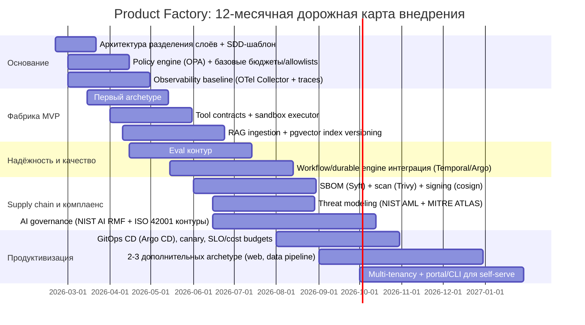

# План разработки и roadmap «Product Factory» для соло‑разработчика, использующего агентов

## Исполнительное резюме

Я отвечу как архитектор платформенной инженерии и безопасных агентных систем, специализирующийся на production‑ready внутренних платформах, supply‑chain security и AI‑governance.

**TL;DR**: как соло‑разработчик, я могу реалистично построить “Product Factory” за 6–12 месяцев, если начну с узкого MVP (один archetype, один golden path, жёсткие контракты tool‑calling, политик‑движок и наблюдаемость), а агентность буду расширять только после появления воспроизводимых quality gates (тесты + security + eval + бюджеты). Базовый принцип — разделить детерминированный **control plane** (оркестрация, политики, исполнение инструментов, аудит) и недетерминированный **intelligence plane** (LLM/агенты/RAG), чтобы агенты никогда не делали side‑effects напрямую. fileciteturn0file0 citeturn15search1turn14search4turn16search5

Исходная цель «Product Factory» в предоставленных материалах сформулирована как построение автоматизированной платформы/сервиса, который **по запросу** создаёт **готовый deployable‑артефакт**: репозиторий с кодом, тестами, IaC, CI/CD, наблюдаемостью и управляемыми AI‑компонентами (агенты/LLM). fileciteturn0file0  
Ключевое требование для production‑реальности — “управляемая агентность”: агенты генерируют планы/код/артефакты через **строгие контракты** (schema) и **политики**, а любые изменения реального мира (деплой, базы, секреты, биллинг) проходят через **policy enforcement**, песочницу и аудит. fileciteturn0file0 citeturn6search1turn16search5turn15search0

Почему в 2026 это важно: требования к ответственности, безопасности и прозрачности растут одновременно с возможностями агенто‑ориентированных систем. В ЕС действует **AI Act** (Regulation (EU) 2024/1689), применяемый поэтапно; официальный таймлайн указывает вступление в применение значимой части правил с 2 августа 2026 и отдельные этапы в 2025–2027. citeturn1search1turn1search0  
Для управления AI‑рисками базовые первоисточники, на которые логично опираться “по умолчанию”, — **entity["organization","NIST","us standards agency"] AI RMF 1.0** и Playbook, плюс стандарт системы менеджмента AI **entity["organization","ISO","standards organization"]/IEC 42001. citeturn2search36turn2search0turn1search2

**Критический вывод для соло‑режима**: ваш главный ограничитель — не написание кода, а **операционный налог** (интеграции, безопасность, наблюдаемость, воспроизводимость, регрессии, стоимость запусков). Поэтому план должен максимизировать (1) воспроизводимость, (2) контроль стоимости и рисков, (3) скорость цикла “запрос → staging”, а объём функциональности в ранних фазах — минимизировать. fileciteturn0file0 citeturn17search3turn20search0

**Короткая таблица допущений (явно)**

| Тема | Базовое допущение (если вы не уточнили иначе) | Почему это разумно |
|---|---|---|
| Старт проекта | 2026‑02‑20 | Требование в задаче + совпадает с опорной дорожной картой в материалах fileciteturn0file0 |
| Команда | 1 человек (1.0 FTE) + агенты как ускоритель | Вы прямо указали “в одного с помощью агентов” |
| Домен/продукты | Домен не задан; “продукт” = deployable‑артефакт (API‑сервис как первый archetype) | Так определено в материалах, и это самый проверяемый MVP для фабрики fileciteturn0file0 |
| Окружения | dev + staging (prod позже) | Снижение риска; promotion только после gates fileciteturn0file0 |
| Регуляторный контекст | EU AI Act потенциально релевантен, GDPR потенциально релевантен | Платформа обрабатывает данные и может подпадать под требования по прозрачности/управлению citeturn1search0turn18search0 |
| Поставщик LLM | API‑модель на старте, с возможностью смены | Минимизация ops‑труда; стоимость управляется бюджетами и метриками citeturn20search0turn16search5 |

## Допущения и варианты масштаба

Я строю фабрику как **внутреннюю платформу**: “golden paths” + стандартизированная поставка + self‑serve, но расширяю self‑serve только после того, как базовый конвейер стабилен. Такая логика соответствует паттерну platform team / internal platform, а измеримость через delivery‑метрики (DORA) — устойчивый способ не “утонуть” в красивой архитектуре. citeturn17search3turn17search0

Ниже — три реалистичных варианта для соло‑разработчика. Это не “три разных проекта”, а один проект с разными целевыми уровнями зрелости.

| Вариант | Объём (scope) | Целевой срок | Что считается “готово” | Что сознательно отложено |
|---|---|---|---|---|
| Small solo | Один archetype (API‑сервис), один pipeline, базовые политики и аудит, deploy в staging | 8–12 недель | 3 последовательных “factory run” на одном commit SHA: запрос → репо → CI gates → deploy в staging + базовые дашборды fileciteturn0file0 | Multi‑tenancy, полноценный портал, расширенная комплаенс‑обвязка |
| Medium solo | 2–3 archetype, воспроизводимые eval‑ворота (agent + RAG), supply‑chain gates (SBOM+подпись), GitOps promotion | 6–12 месяцев | “Factory” как продукт: стабильные релизы фабрики, метрики cycle time/cost per run, rollback сценарии, минимум governance по AI RMF/ISO 42001 fileciteturn0file0 citeturn2search36turn1search2turn3search36 | Enterprise‑уровень требований “всё сразу”, гибрид/он‑прем по умолчанию |
| Large solo | Multi‑tenancy, self‑serve портал/CLI, несколько окружений и доменов, расширенные контролы | 12–18+ месяцев | Масштабирование потребления фабрики и формальные контрольные точки для риска/стоимости/качества | Для соло без поддержки — высокий риск провала сроков и качества |

Ключевая практическая рекомендация: **выбирайте Small или Medium как целевую рамку**, а элементы Large делайте “как миграционный путь” (совместимые интерфейсы, версии, контракты), иначе вы платите операционный налог заранее. fileciteturn0file0

## Архитектура и стек

### Архитектурный каркас

Целевой архитектурный принцип — разделение **deterministic control plane** и **intelligence plane**. В предоставленном документе это обозначено как главный приём превращения “агентов, пишущих код” в фабрику с воспроизводимостью, контролем и масштабированием. fileciteturn0file0  
Практически это означает:

- всё, что можно заранее формализовать (политики, последовательности операций, ретраи, идемпотентность, аудит), уходит в детерминированный workflow/оркестратор; fileciteturn0file0 citeturn8search0turn9search14  
- агентам разрешены только строго типизированные действия через tool‑calling/structured outputs, а side‑effects исполняются отдельным executor‑ом под контролем policy engine. citeturn15search1turn14search4turn6search1

```mermaid
flowchart TB
  subgraph DC[Control Plane: детерминированный контур]
    API[Factory API]
    WF[Durable workflow execution]
    PE[Policy Engine (OPA/Rego)]
    TR[Tool Registry (JSON Schema, versioned)]
    EX[Tool Executor: sandbox + idempotency + retries]
    AUD[(Audit log / event store)]
  end

  subgraph INT[Intelligence Plane: агенты/LLM]
    AR[Agent runtime]
    LLM[LLM API / serving]
    RAG[RAG: retrieve/rerank/context pack]
    EV[Evaluators: offline/online, trace grading]
  end

  subgraph DATA[Данные]
    SO[(Systems of record)]
    VDB[(Vector index)]
    OBJ[(Object storage)]
  end

  subgraph OBS[Наблюдаемость]
    OTel[OpenTelemetry SDK/Collector]
    MET[(Metrics)]
    LOG[(Logs)]
    TRC[(Traces)]
  end

  API --> WF --> PE
  WF --> AR
  AR --> TR --> EX --> SO
  EX --> VDB
  EX --> OBJ
  AR --> RAG --> VDB
  RAG --> LLM
  AR --> LLM
  EV --> WF

  API --> OTel
  WF --> OTel
  AR --> OTel
  EX --> OTel
  OTel --> MET
  OTel --> LOG
  OTel --> TRC
  WF --> AUD
  EX --> AUD
```

### Критика и рекомендации по четырём осям

**Масштабируемость.** Сильная сторона схемы — возможность масштабировать интеллект отдельно от контроля: агентных воркеров может быть много, но контрольный контур остаётся воспроизводимым и управляет side‑effects через политики/аудит. fileciteturn0file0 citeturn15search0  
Соло‑риск: преждевременная multi‑tenancy/self‑serve добавляет требования к изоляции, биллингу, поддержке и тем самым существенно увеличивает операционный налог. Поэтому multi‑tenancy — поздний milestone (Medium/Large). fileciteturn0file0

**Безопасность.** Практическая база для агентных рисков — руководствоваться **entity["organization","OWASP","security nonprofit"] Top 10 for LLM Applications** (prompt injection, insecure output handling, excessive agency, model DoS/unbounded consumption и др.). citeturn4search0turn4search33  
Для структурированного threat modeling полезно использовать taxonomy adversarial ML от **entity["organization","NIST","us standards agency"] (NIST AI 100‑2e2025)** и knowledge base **entity["organization","MITRE","research nonprofit"] ATLAS. citeturn2search1turn5search21  
Соло‑рекомендация: считать tool executor “критическим периметром”, потому что именно он делает side‑effects; все привилегированные tools должны быть (а) идемпотентны, (б) журналируемы, (в) ограничены allowlist + budgets. fileciteturn0file0 citeturn6search1turn16search5

**Поддерживаемость.** Ваш “вечный враг” — невоспроизводимость. Поэтому всё, что влияет на поведение и стоимость, нужно версионировать: archetypes, tool schemas, политики, версии моделей/маршрутизацию, индексы/эмбеддинги, eval‑наборы, инфраструктуру. Это требование прямо сформулировано в предоставленном документе как принцип “артефакты важнее магии”. fileciteturn0file0  
На практике это означает Git‑версионирование + release tags + “eval baseline” как gate. citeturn15search0turn14search4

**Стоимость.** Стоимость в агентных системах растёт “скачками”: (1) токены/инструменты, (2) неограниченные траектории, (3) ретраи, (4) рост индексов и логов. Поэтому cost governance (бюджеты на токены/итерации/tool calls/время) должен быть встроен как policy, а не как “финансовый отчёт потом”. fileciteturn0file0 citeturn20search0turn16search5

### Варианты технологического стека для соло

Ниже — практичные “пакеты” (не единственные), выбранные по критерию: минимальная ops‑сложность при сохранении архитектурных интерфейсов.

| Компонент | Small solo (минимум ops) | Medium solo (production‑ориентир) | Large solo (масштаб) |
|---|---|---|---|
| Политики | OPA как цель, сначала небольшой набор правил (allowlist+budgets) citeturn6search1turn6search3 | OPA bundles/decision logs + расширение по risk tiers citeturn6search6turn6search1 | Политики по доменам/тенантам, централизованное управление |
| Наблюдаемость | OTel Collector + OTLP как стандарт передачи citeturn6search2turn6search7 | Полный “3 сигнала” + SLO/alerts | Multi‑tenant observability + ретеншн/комплаенс |
| Supply chain | SBOM baseline по CISA + скан в CI citeturn3search0turn3search36turn10search0 | SBOM + подпись/аттестации (Sigstore Cosign) citeturn11search0turn11search1turn3search6 | Политики допуска артефактов (provenance‑проверка), строгие требования |
| RAG storage | PostgreSQL + pgvector на старте citeturn12search0 | миграция триггерно в Qdrant/Weaviate/Milvus citeturn13search2turn12search5turn13search1 | распределённая vector infra + шардирование |
| Оркестрация | простой orchestrator (или только CI) для MVP; durable execution как следующий шаг | Durable workflows (Temporal/аналог) для pause/resume, ретраев, аудита citeturn8search0turn9search14 | Несколько очередей/воркеров, versioning workflow, более строгие SLO |
| Agent framework | Agents SDK (если вы в экосистеме entity["company","OpenAI","ai company"]) + structured outputs + trace grading citeturn16search3turn14search4turn15search0 | то же + расширенные eval‑ворота (trace eval runs) citeturn15search0turn16search0 | multi‑agent с изоляцией полномочий и утверждений |

## Дорожная карта, вехи и критерии успеха

### Roadmap‑поток “от запроса до промоушена”

```mermaid
flowchart TB
  RQ[Запрос: цель + ограничения] --> PLAN[Агент: план/таски/артефакты (структурно)]
  PLAN --> GEN[Генерация репозитория archetype]
  GEN --> CI[CI: build + unit/integration]
  CI --> SEC[Security gates: SBOM+scan+policy]
  SEC --> EVAL[Eval gates: RAG/agent миссии + trace grading]
  EVAL --> STG[Deploy в staging (GitOps)]
  STG --> MON[Online checks: SLO + cost budgets + drift]
  MON --> DEC{Decision point: promote?}
  DEC -- нет --> RB[Rollback/Freeze + инцидент]
  DEC -- да --> PRD[Promote to prod]
```

Ключевой смысл: фабрика — это **конвейер с измеримыми воротами**, а не “агент, который что‑то написал”. Ровно это рекомендуется в предоставленном документе как способ ежедневного прогресса. fileciteturn0file0

### Роли и FTE‑оценка для соло

В материалах минимальная жизнеспособная орг‑модель для фабрики описывается как 8–12 ролей на старт (часть совмещается). fileciteturn0file0  
В соло‑режиме я превращаю это в “шляпы” (всё равно нужно делать те же виды работы, просто последовательно):

| Шляпа | Средняя доля времени в Medium solo | Типовые результаты (deliverables) |
|---|---:|---|
| Platform architect | 15% | ADR/SDD, границы agentности, интерфейсы, миграционные триггеры fileciteturn0file0 |
| Workflow/durable execution | 20% | ретраи, идемпотентность, компенсации; воспроизводимые run‑ы citeturn8search0turn9search14 |
| Agent/LLM инженер | 20% | schemas, tool routing, budgets, trace grading/evals citeturn15search1turn14search4turn15search0 |
| RAG/data инженер | 15% | ingestion, versioning индекса, качество retrieval citeturn12search0turn13search2 |
| SRE/наблюдаемость | 15% | OTel traces/metrics/logs, SLO/alerts, runbooks citeturn6search2turn6search7 |
| AppSec/LLMSec | 10% | OWASP LLM Top10 controls, supply chain gates, threat modeling citeturn4search33turn3search6turn2search1 |
| Governance | 5% | AI RMF/ISO 42001 минимальный контур, decision points, change‑control citeturn2search36turn1search2turn2search0 |

### Фазы, сроки и deliverables как чек‑листы

Ниже — план, синхронизированный с 12‑месячной опорной дорожной картой, зафиксированной в предоставленном документе (старт 2026‑02‑20). fileciteturn0file0  
Это план для **Medium solo**; Small — это “обрезать до первых 8–12 недель”, Large — “добавить мульти‑тенантность и портал после стабилизации”.

**Фаза инициации и рамок риска (2 недели, 2026‑02‑20 → 2026‑03‑05)**  
Deliverables:
- [ ] PRD фабрики (цель, границы MVP, “definition of done”) — один документ, один источник истины  
- [ ] Классы действий агента: разрешено/запрещено (особенно privileged actions)  
- [ ] Data map: какие источники данных, где PII, как ретеншн и доступы  
- [ ] Risk register v1 (10–15 рисков, владелец — вы)  
- [ ] Decision points v1 (что может заставить менять стек/архитектуру)

Success criteria:
- PRD покрывает минимум: один archetype, один “golden path”, staging‑деплой, измеримые gates. fileciteturn0file0  
- Любой tool с side‑effects категоризирован по risk tier и требует политики/approval. citeturn16search5turn6search1

**Фаза основания (4–8 недель, 2026‑02‑20 → 2026‑04‑17)**  
(совпадает с блоком “Основание” в Gantt: архитектура слоёв, OPA, observability baseline) fileciteturn0file0  
Deliverables:
- [ ] SDD + ADR‑набор (архитектурные решения: workflow engine, policy engine, storage, LLM provider)  
- [ ] Policy engine “минимальный”: allowlist tools, budgets (токены/tool calls/время), запрет прямых side‑effects  
- [ ] OpenTelemetry базовый трейсинг “factory run” end‑to‑end + аудит tool calls  
- [ ] Tool registry: JSON Schema для каждого инструмента, версия, owner, risk tier

Success criteria:
- Каждый factory run даёт trace + audit‑события, и по trace можно восстановить “что произошло” (observability как обязательная часть). citeturn6search2turn6search7turn15search0  
- Политики отделены от кода и могут блокировать привилегированные действия (OPA как policy decision point). citeturn6search1

**Фаза MVP фабрики (8–12 недель, 2026‑03‑15 → 2026‑06‑15)**  
(в Gantt: первый archetype, contracts+executor, RAG ingestion/pgvector) fileciteturn0file0  
Deliverables:
- [ ] Archetype “API service”: репозиторий с минимальным сервисом, тестами, Docker/IaC, документацией  
- [ ] Tool executor: sandbox + идемпотентность + ретраи (для любых внешних side‑effects)  
- [ ] CI: unit/integration + минимальные security checks + сборка артефакта  
- [ ] RAG ingestion (если нужен): Postgres+pgvector, версионирование индекса/чанкинга

Success criteria:
- 3 подряд воспроизводимых прогона “цель → repo → CI → staging”, без ручного вмешательства кроме approval шагов. fileciteturn0file0  
- Индекс RAG можно откатить на версию N‑1, сохранив воспроизводимость retrieval. citeturn12search0

**Фаза качества и надёжности (3 месяца, 2026‑04‑15 → 2026‑07‑15)**  
(в Gantt: eval контур, integration durable engine Temporal/Argo) fileciteturn0file0  
Deliverables:
- [ ] Offline eval gates: набор “миссий агента” + регрессионные кейсы (минимум 30–50)  
- [ ] Trace grading и отчёт по регрессам (при изменении prompts/tools/policies) citeturn15search0  
- [ ] Durable execution (если вы берёте Temporal/аналог): ретраи activity, pause/resume, human‑in‑the‑loop

Success criteria:
- Любой релиз фабрики блокируется, если eval‑метрики ухудшились сверх порога (регресс‑ворота). citeturn15search0  
- Разделение workflow vs activity соблюдено: “непредсказуемое” (LLM/tool calls/HTTP) вынесено в activity; это согласуется с практикой durable execution. citeturn9search14turn9search0

**Фаза supply‑chain и комплаенса (3–4 месяца, 2026‑06‑01 → 2026‑09‑30)**  
(в Gantt: SBOM+scan+sign, threat modeling, AI governance) fileciteturn0file0  
Deliverables:
- [ ] SBOM как артефакт сборки (как минимум machine‑processable поля по guidance CISA) citeturn3search0turn3search36  
- [ ] Сканирование уязвимостей (Trivy) в CI с порогами и исключениями “по правилам” citeturn10search0  
- [ ] Подпись артефактов (Sigstore Cosign) и проверка подписи в deployment gate citeturn11search0turn11search1  
- [ ] Threat modeling пакет: OWASP LLM Top10 мэппинг + NIST AML taxonomy + ATLAS как справочник техник citeturn4search33turn2search1turn5search21  
- [ ] Минимальный governance‑контур: AI RMF (Govern/Map/Measure/Manage) + ISO/IEC 42001 “как система менеджмента” citeturn2search36turn2search0turn1search2

Success criteria:
- Любой деплой‑артефакт имеет SBOM и подпись; неподписанный/непроверенный артефакт не промоутится. citeturn3search36turn11search1turn3search6  
- High‑risk изменения требуют явного approval и записи decision record (auditability). citeturn6search1turn2search0

**Фаза продуктивизации и масштабирования потребления (3–4 месяца, 2026‑08‑01 → 2026‑12‑15)**  
(в Gantt: GitOps CD, canary, SLO/cost budgets, 2–3 archetype, multi‑tenancy/portal) fileciteturn0file0  
Deliverables:
- [ ] GitOps CD (например, Argo CD): staging→prod promotion как PR в env‑репозиторий citeturn7search4  
- [ ] Canary/поэтапное включение + SLO/cost budgets как критерии промоушена  
- [ ] 2–3 дополнительных archetype (web/data pipeline)  
- [ ] (Опционально) portal/CLI/self‑serve

Success criteria:
- Rollback занимает минуты: revert commit desired state → синхронизация окружения. citeturn7search4  
- Метрики throughput/instability (DORA) и фабричные метрики (cycle time, cost per run) демонстрируют устойчивый тренд улучшения. citeturn17search3turn17search0

### Сводная таблица зависимостей

| Зависимость | Почему блокирует | Как снизить риск |
|---|---|---|
| Секреты/ключи/доступы | Без этого нельзя безопасно делать CI/CD и tools | Сразу выбрать подход (минимум: секреты CI + запрет логирования) + ротация ключей при инциденте citeturn16search5 |
| Наблюдаемость | Без трасс/аудита нельзя расследовать и улучшать | OTel baseline в фазе основания citeturn6search2turn6search7 |
| Политики | Без PEP/allowlist агенты становятся “суперпользователем” | OPA как policy decision point и budgets по умолчанию citeturn6search1turn6search3 |
| Eval‑контур | Без gates регрессии становятся нормой | Trace grading + регрессионные миссии citeturn15search0turn16search0 |
| Supply chain | Без SBOM/подписи трудно доказать целостность | CISA SBOM + SLSA‑ориентированная изоляция сборки + Cosign citeturn3search36turn3search6turn11search0 |

### Gantt‑таймлайн

Ниже — Gantt, совпадающий по структуре и датам с опорной 12‑месячной дорожной картой в предоставленном документе (старт 2026‑02‑20). fileciteturn0file0



## Риски и меры управления

### Реестр рисков

Оценка: вероятность (Low/Med/High), влияние (Low/Med/High). В соло‑режиме я считаю High‑impact риски “приоритетом по умолчанию”, потому что восстановление после инцидента съедает недели.

| Риск | Вероятность | Влияние | Митигирующие меры (до) | План на случай сбоя (после) |
|---|---|---|---|---|
| Unbounded consumption / Model DoS (агенты бесконечно вызывают LLM/tools) | High | High | Budgets в policy (токены, tool calls, wall‑time), лимиты на gateway; мониторинг cost per run citeturn4search33turn20search0turn6search1 | Авто‑останова workflow по бюджету; аварийный режим “read‑only agents”; анализ trace и блокировка паттерна citeturn15search0 |
| Prompt injection через RAG/внешние данные | Med | High | “Untrusted data never drives tools”: структурная экстракция только валидируемых полей; guardrails + approvals citeturn16search5turn14search4 | Отключить внешние источники; откат индекса; ротация ключей; пост‑мортем |
| Excessive agency (агент получает слишком много полномочий) | Med | High | Allowlist tools по risk tier; human approval для write‑операций; строгие схемы tool calling citeturn4search33turn16search5turn15search1 | “Kill switch”: отключить privileged tools; временно запретить auto‑promotion |
| Неидемпотентные side‑effects при ретраях | Med | High | Idempotency keys + upsert/unique constraints; разделение workflow (детерминизм) и activity (ошибки/ретраи) citeturn9search14turn9search0turn8search0 | Cleanup workflow + восстановление desired state через GitOps revert; фиксы и тест‑регресс |
| Supply‑chain атаки/компрометация зависимостей | Med | High | SBOM (CISA) + скан (Trivy) + подпись (Cosign) + SLSA‑требования к сборке (изоляция/без секретов) citeturn3search36turn10search0turn11search0turn3search6 | Откат на “последний подписанный хороший”; блок релизов; ускоренный патч |
| Утечки секретов в логах/трейсах | Med | High | Redaction + запрет логирования чувствительных полей; минимизация секретов; access control к observability citeturn6search2turn6search7 | Ротация секретов; аудит; обновление политики логирования |
| Регуляторные/политические изменения | Med | Med/High | Регуляторный watch; пересмотр risk tier на decision points; минимальный governance по AI RMF/ISO 42001 citeturn1search0turn2search0turn1search2 | Переприоритизация roadmap; заморозка функций, попадающих в high‑risk |
| Невозможность расследовать инциденты (нет аудита/трейсов) | Med | High | OTel baseline с первого end‑to‑end run; audit log для tool calls citeturn6search2turn15search0 | Stop rollout; приоритет №1 — восстановить наблюдаемость |

### Привязка рисков к первоисточникам контролей

- Классы угроз (prompt injection, insecure output handling, excessive agency, model DoS/unbounded consumption) систематизированы в OWASP Top 10 for LLM Applications. citeturn4search33turn4search0  
- Таксономия атак/митигирующих мер для adversarial ML — NIST AI 100‑2e2025. citeturn2search1  
- “Матрица” техник и практические кейсы для AI‑систем — MITRE ATLAS (fact sheet). citeturn5search21  
- Для организационного управления рисками — AI RMF 1.0 и Playbook (Govern/Map/Measure/Manage). citeturn2search36turn2search0turn2search7  
- Для secure SDLC (включая GenAI‑специфичные рекомендации) — NIST SSDF и профиль SP 800‑218A. citeturn19search4turn19search3

## Стоимость и бюджетные сценарии

Я разделяю оценку стоимости на: **(1) люди/время**, **(2) LLM‑стоимость**, **(3) инфраструктура/наблюдаемость/данные**, **(4) стоимость риска (инциденты)**. В соло‑режиме пункт (4) часто дороже всех остальных, поэтому бюджеты и gates — часть экономической модели, а не “про безопасность”. citeturn20search0turn4search33turn15search0

### Низкая детализация

| Вариант | Трудозатраты (solo) | Денежная стоимость (характер) | Что сильнее всего влияет |
|---|---|---|---|
| Small | 2–3 месяца | низкая/средняя | частота factory runs и LLM‑токены citeturn20search0 |
| Medium | 6–12 месяцев | средняя | наблюдаемость + eval‑контур + supply chain + LLM citeturn6search2turn15search0turn3search36turn20search0 |
| Large | 12–18+ месяцев | высокая | multi‑tenancy, комплаенс, эксплуатация |

### Средняя детализация (структура бюджета)

| Статья | Как считать | Комментарий |
|---|---|---|
| LLM inference | токены_in/out × цена за 1M токенов | Цены зависят от модели; официальный прайс показывает порядок цен по моделям и cached input citeturn20search0 |
| Eval/trace grading | число прогонов eval × токены × цена | Trace grading требует хранения/анализа трасс и прогонов оценок citeturn15search0 |
| Observability | объём логов/трейсов/метрик × ретеншн | OTel/OTLP задают стандартизированный пайплайн; стоимость зависит от backend citeturn6search2turn6search7 |
| Data/RAG | размер индекса + запросы + хранение | pgvector — дешёвый старт; миграция к vector DB при росте требований citeturn12search0turn13search2 |
| Supply chain | “время на интеграцию” + хранение артефактов | SBOM/scan/sign — в основном инженерная интеграция; инструменты: Syft/Trivy/Cosign citeturn10search2turn10search0turn11search0 |

### Высокая детализация: параметрическая модель LLM‑стоимости + примеры

Официальный прайс entity["company","OpenAI","ai company"] задаёт цены за 1M токенов (input/cached input/output) для ряда моделей. citeturn20search0  
Это позволяет честно считать стоимость “фабричного прогона” без гадания про инфраструктуру.

**Формула (упрощённо):**

`LLM_cost_month = runs_per_month * (input_tokens/1e6 * price_in + output_tokens/1e6 * price_out)`

(если используете cached input, добавьте долю cached‑токенов по отдельной цене). citeturn20search0

Ниже — **примерные** сценарии (это допущения о нагрузке; вы можете подставить свои числа).

| Вариант | Прогонов фабрики в день | Input токенов на прогон | Output токенов на прогон | Модель | Оценка LLM‑стоимости в месяц (30 дней) |
|---|---:|---:|---:|---|---:|
| Small | 10 | 50k | 10k | gpt‑5‑mini | ≈ $4.35 citeturn20search0 |
| Medium | 50 | 120k | 25k | gpt‑5.1 | ≈ $291.25 citeturn20search0 |
| Large | 200 | 200k | 40k | gpt‑5.2 | ≈ $2,760.00 citeturn20search0 |

Пояснение расчёта (пример Medium):  
runs/month = 50×30 = 1500; cost = 1500×(120k/1e6×$1.25 + 25k/1e6×$10) = 1500×(0.15 + 0.25) = $600; но если часть токенов кэшируется (cached input), стоимость может быть ниже; реальная будет зависеть от структуры промптов/контекстов и кэширования. citeturn20search0

**Сценарии “дешевле/дороже” (без привязки к конкретному облаку):**
- Снизить стоимость обычно проще через (а) уменьшение токенов (контракты, компактные schemas, “не тащить всё в контекст”), (б) кэширование повторяемых контекстов, (в) более дешёвую модель для части шагов (например, gpt‑5‑mini для “well‑defined” задач), чем через “оптимизацию инфраструктуры”. citeturn20search0turn14search4turn15search1  
- Самохост модели обычно двигает стоимость из “переменной по токенам” в “постоянную по GPU/ops”; экономически это оправдано, когда есть стабильная высокая нагрузка или требования к суверенности данных — это отражено как типичный decision point и в предоставленных материалах. fileciteturn0file0 citeturn2search0

## Эксплуатация, governance, change‑control, rollout и коммуникации

### KPI и мониторинг

Я использую два слоя KPI: delivery performance (DORA) и фабричные (агентные) метрики.

**Delivery‑KPI (DORA):** throughput/instability и конкретные метрики (deployment frequency, lead time, change fail rate, failed deployment recovery time, deployment rework rate). DORA официально описывает и обновляет эволюцию метрик (включая добавление deployment rework rate в 2024). citeturn17search3turn17search0  

**Фабричные KPI:**
- Cycle time: “запрос → PR”, “PR → staging”, “staging → prod” (как в предоставленных материалах). fileciteturn0file0  
- Automation coverage по risk tier: доля шагов без участия человека, отдельно для low/med/high‑risk (чтобы не расширять автономность вслепую). fileciteturn0file0  
- Quality gates pass rate: доля прогонов, прошедших тесты+security+eval. citeturn15search0turn10search0turn11search1  
- Cost per run + incidents unbounded consumption. citeturn20search0turn4search33  
- RAG‑качество (если применимо): метрики retrieval/faithfulness по вашим eval наборам (в материалах это оформлено как отдельный eval‑контур). fileciteturn0file0

**Наблюдаемость:** базовый стандарт — OpenTelemetry + OTLP: Collector описан как vendor‑agnostic компонент для приёма/обработки/экспорта телеметрии, а OTLP — стабильный протокол доставки трейсов/метрик/логов. citeturn6search2turn6search7

### Governance и decision points

Я выстраиваю governance как “лёгкий каркас”, основанный на AI RMF, а не как бюрократию: AI RMF задаёт функции Govern/Map/Measure/Manage и предполагает, что организация выбирает объём внедрения по контексту и риску. citeturn2search36turn2search0turn2search7  
ISO/IEC 42001 добавляет управленческую дисциплину AIMS (политики, процедуры, PDCA‑цикл) как стандарт системы менеджмента. citeturn1search2

**Decision points, которые стоит формализовать как ADR‑триггеры (с измеримыми порогами):**
- API‑LLM → self‑host: триггеры — cost per run, требования к суверенности/персональным данным, латентность, контроль версий. fileciteturn0file0 citeturn20search0turn18search0  
- pgvector → выделенная vector DB: триггеры — рост индекса, требования к фильтрации/строгому режиму, multi‑tenant, SLA по латентности. citeturn12search0turn13search2turn12search5  
- Расширение инструментов агента: каждый новый tool с side‑effects требует угроз‑анализа по OWASP/NIST/ATLAS и политики доступа/бюджетов. citeturn4search33turn2search1turn5search21turn6search1

### Change‑control процесс

В соло‑режиме change‑control нужен не “для отчётности”, а чтобы агенты не ускоряли хаос.

**Классы изменений (risk‑based):**
- Low: документация, refactor без изменения контрактов/policies.  
- Medium: новые archetype, изменения CI, новые источники RAG.  
- High: новый tool с side‑effects, изменения политик, изменения секретов, расширение агентности/автопромоушена.

**Правила ворот (gates):**
- Medium: обязателен зелёный CI + security scan + минимальный eval. citeturn10search0turn15search0  
- High: ручной approval + threat‑мэппинг (OWASP/NIST/ATLAS) + обязательный аудит + подпись артефактов. citeturn4search33turn2search1turn11search0

### Rollout и rollback

**Rollout:** staging → онлайн‑проверки → promote. Это согласуется с подходом “trace grading + онлайн‑метрики” как решение о продвижении. citeturn15search0  
**GitOps CD:** Argo CD автоматическая синхронизация делает деплой через commit в Git; документация подчёркивает семантику autosync и нюанс, что rollback нельзя выполнить для приложения с включённым automated sync (важно учесть в вашей процедуре). citeturn7search4  

**Практический rollback‑план (минимум):**
- код/конфиги: revert commit desired state → sync;  
- артефакты: откат на последний подписанный и верифицированный (Cosign verify) образ; citeturn11search1  
- данные: только backward‑compatible миграции (expand/contract), иначе вы теряете “безболезненный” rollback.

### План коммуникации со стейкхолдерами

Даже если вы “соло”, вам почти всегда нужен хотя бы один стейкхолдер (спонсор/потребитель/безопасность). Я бы вёл коммуникацию через артефакты и метрики:

| Аудитория | Формат | Частота | Что показываю |
|---|---|---|---|
| Спонсор/руководитель | 15‑мин демонстрация “запрос → staging” + 1‑страничный статус | еженедельно | cycle time, cost per run, блокеры, решения decision points citeturn17search3turn20search0 |
| Безопасность/AppSec | обзор risk register + результаты supply chain gates | раз в 2–4 недели | OWASP LLM Top10 мэппинг, SBOM/scan/sign статус citeturn4search33turn3search36turn11search0 |
| Потребители (разработчики) | quickstart + пример archetype | по релизу | golden path, ограничения, шаблонные решения |
| Операции/SRE | runbooks + SLO | раз в месяц | алерты, ретеншн, инциденты, MTTR citeturn17search3turn6search2 |

## Инструменты и шаблоны

### Рекомендуемый tooling‑набор для соло

- Трекинг задач: **entity["company","GitHub","code hosting company"] Issues/Projects + строгие labels по risk tier. citeturn10search6  
- CI: GitHub Actions как единая точка для build/test/security/eval. citeturn10search6  
- Policy as code: OPA/Rego. citeturn6search1turn6search3  
- Observability: OpenTelemetry + OTLP, минимально — трейсинг фабричного прогона и аудит tool calls. citeturn6search2turn6search7  
- GitOps CD: Argo CD (или эквивалент). citeturn7search4  
- SBOM/scan/sign: Syft + Trivy + Cosign (Sigstore). citeturn10search2turn10search0turn11search0  
- Agent dev: structured outputs + tool calling + trace grading/Agents SDK (если вы в экосистеме OpenAI). citeturn14search4turn15search1turn16search3turn15search0

### Шаблон ADR (полностью заполненный пример)

```markdown
# ADR-0001: Выбор движка оркестрации для фабрики

Дата: 2026-02-20
Статус: accepted

Контекст
Я строю Product Factory как соло‑разработчик с агентами. Мне нужна воспроизводимая оркестрация, где:
- наблюдаемая история выполнения (для аудита и отладки),
- ретраи для внешних операций,
- возможность human approval,
- возможность паузы/возобновления длинных прогонов.

Драйверы
- Надёжность и воспроизводимость
- Управляемая агентность (agents ≠ side-effects)
- Низкий операционный налог (solo)
- Наблюдаемость и аудит

Рассмотренные варианты
A) Temporal / durable workflows (workflows детерминированы; activity для недетерминированного)
B) Argo Workflows (K8s-native DAG/steps; хорошо для batch)
C) Без workflow engine на старте (только CI steps), затем миграция

Решение
Принимаю C как старт на 8–12 недель для MVP фабрики, затем перехожу к A (durable workflows) при достижении:
- 50+ прогонов фабрики в день или
- потребности в pause/resume и human approval в прод‑контуре.

Обоснование
- Для MVP важна скорость и минимальный ops.
- Для production агентных пайплайнов нужна durable execution семантика ретраев и истории.

Последствия
Плюсы:
- Быстрое достижение end-to-end результата на MVP
- Чёткий план миграции к durable execution

Минусы:
- В MVP сложнее делать сложные компенсации и паузы
- Переход потребует выделенного времени на интеграцию

Триггеры пересмотра
- Инциденты из-за ретраев/дублирования side-effects
- Появление требований “пауза/возобновление” и human approval
- Рост стоимости инцидентов выше стоимости внедрения durable engine
```

### PR‑шаблон (без “пустых” плейсхолдеров)

```markdown
## Цель изменения
Кратко: что улучшено и зачем.

## Класс риска
Выберите один вариант и удалите остальные строки:
- risk: low
- risk: medium
- risk: high

## Изменения затрагивают
- contracts (tool schemas): да/нет
- policies (OPA): да/нет
- tools с side-effects: да/нет
- eval наборы/гейты: да/нет
- CI/CD: да/нет
- секреты/доступы: да/нет

## Gates
- [ ] Unit tests зелёные
- [ ] Integration tests зелёные
- [ ] Security scan (Trivy) зелёный или есть задокументированные исключения
- [ ] SBOM (Syft) сгенерирован
- [ ] Подпись артефакта выполнена (Cosign) и верификация проходит
- [ ] Offline eval (trace grading / миссии агента) не регрессирует

## План отката
- Git revert commit SHA
- Откат образа на предыдущий подписанный digest
- Для данных: миграции backward-compatible (expand/contract)

## Наблюдаемость
- [ ] Трейсы factory run доступны
- [ ] Audit log tool calls доступен
```

### Risk register (шаблон + 3 заполненных строки)

```markdown
# Risk Register (v1)

| ID | Риск | Вероятность | Влияние | Владелец | Митигирующие меры | План при инциденте | Метрика/сигнал |
|---|---|---|---|---|---|---|---|
| R-001 | Unbounded consumption / Model DoS | High | High | Solo | budgets: tokens/tool-calls/time + allowlist | kill workflow + disable privileged tools | cost per run, tool calls/run |
| R-002 | Prompt injection через RAG | Med | High | Solo | structured extraction + approvals for write tools | отключить внешние источники + откат индекса | suspicious tool calls |
| R-003 | Supply-chain компрометация | Med | High | Solo | SBOM+scan+sign+verify in gates | rollback на last signed | scan findings, signature verify |
```

### Список первичных источников (как ссылки, пригодные для внутренней базы знаний)

```text
NIST AI RMF 1.0 (NIST AI 100-1): https://nvlpubs.nist.gov/nistpubs/ai/nist.ai.100-1.pdf
NIST AI RMF Playbook: https://airc.nist.gov/airmf-resources/playbook/
ISO/IEC 42001: https://www.iso.org/standard/42001
EU AI Act (Regulation (EU) 2024/1689): https://eur-lex.europa.eu/eli/reg/2024/1689/oj/eng
EU AI Act implementation timeline: https://ai-act-service-desk.ec.europa.eu/en/ai-act/eu-ai-act-implementation-timeline
GDPR (Regulation (EU) 2016/679): https://eur-lex.europa.eu/eli/reg/2016/679/oj/eng
OWASP Top 10 for LLM Applications 2025 (PDF): https://owasp.org/www-project-top-10-for-large-language-model-applications/assets/PDF/OWASP-Top-10-for-LLMs-v2025.pdf
CISA 2025 Minimum Elements for SBOM (PDF): https://www.cisa.gov/sites/default/files/2025-08/2025_CISA_SBOM_Minimum_Elements.pdf
SLSA spec and requirements: https://slsa.dev/spec/v1.0/requirements
OpenTelemetry Collector: https://opentelemetry.io/docs/collector/
OTLP spec: https://opentelemetry.io/docs/specs/otlp/
OPA docs: https://www.openpolicyagent.org/docs/latest
Argo CD autosync semantics: https://argo-cd.readthedocs.io/en/latest/user-guide/auto_sync/
Syft: https://github.com/anchore/syft
Trivy vulnerability scanning: https://trivy.dev/docs
Sigstore Cosign quickstart: https://docs.sigstore.dev/quickstart/quickstart-cosign/
OpenAI Pricing: https://platform.openai.com/docs/pricing/
OpenAI Agents SDK: https://platform.openai.com/docs/guides/agents-sdk/
OpenAI Structured Outputs: https://platform.openai.com/docs/guides/structured-outputs
OpenAI Function calling: https://platform.openai.com/docs/guides/function-calling/
OpenAI Trace grading: https://platform.openai.com/docs/guides/trace-grading
DORA metrics guide: https://dora.dev/guides/dora-metrics/
```

entity["organization","European Union","political union"] entity["organization","CISA","us cyber agency"] entity["organization","Cloud Native Computing Foundation","cloud native foundation"]