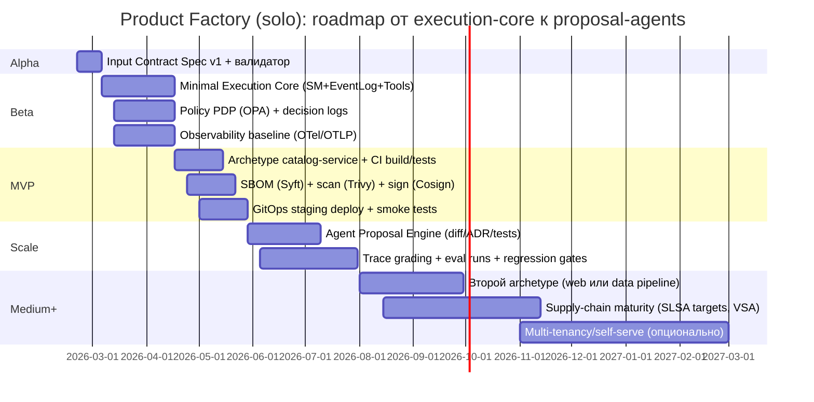

# Системный аудит и corrective‑план для «Product Factory» в соло‑режиме с агентами

## Исполнительное резюме

Вы строите не «платформу разработки» в классическом смысле, а **детерминированный engine поставки артефактов** (execution core) с **контролируемым недетерминированным интеллект‑слоем** (агенты/LLM). Это направление стратегически сильное: оно согласуется с тем, как современные поставщики агентных платформ рекомендуют строить наблюдаемую, оцениваемую и управляемую агентность (structured outputs, approvals, trace/evals). citeturn13search1turn7search0turn12search2

Главный практический риск, который вы описали, подтверждается исследованием первоисточников: **если “ядро выполнения” не формализовано и не воспроизводимо, агентный слой неизбежно превращается в prompt‑хаос**, потому что (а) внешние действия неидемпотентны и ретраятся, (б) policy enforcement должен быть отделён от логики, (в) supply‑chain артефакты должны формироваться в доверенной контрольной плоскости, а не «тенантом» (т.е. тем, кто пишет код/шаги). Это прямо поддерживается публикациями по workflow‑исполнению (идемпотентные activity с ретраями), policy‑движкам (PDP/PEP), supply‑chain (SLSA provenance/attestations) и SBOM‑практикам. citeturn4search26turn4search2turn1search5turn1search48

Ниже — строгое разложение ответственности слоёв, blueprint минимального execution‑ядра, затем дорожная карта (Small/Medium/Large для соло‑режима), риски, KPI/мониторинг, governance/change‑control и шаблоны артефактов.

### Таблица допущений

| Параметр | Принятое допущение | Почему |
|---|---|---|
| Роль | Я — соло‑разработчик, использую агентов как ускоритель, но оставляю контроль side‑effects за детерминированным контуром | Это соответствует best practice “keep approvals on” и разделению tool‑calling vs execution citeturn13search1turn12search2 |
| Старт | 2026‑02‑20 | Указано вами |
| Домен продукта | Не указан; первым archetype считаю «API‑сервис» | Это самый проверяемый артефакт для фабрики (build/test/deploy) и минимальный риск |
| Окружения | dev + staging (prod позже) | Для снижения риска: promotion только после gates (тесты+security+eval) citeturn7search0turn11search6 |
| Оркестрация | Сначала “минимальный orchestrator” (внутренний), затем durable engine (Temporal/Argo) по триггерам | Durable engine добавляет устойчивость и историю (audit), но увеличивает ops‑нагрузку; activity должны быть идемпотентны citeturn4search26turn5search6 |

## Проверка тезисов и уточнение «минимального ядра»

### Почему тезис «сначала execution core без AI» технически оправдан

Ваш тезис «execution engine без AI — уже продукт» подтверждается тем, как устроены надёжные системы оркестрации:

- В durable workflow‑подходе внешние/недетерминированные операции изолируются в **activities**, которые **автоматически ретраятся** и **должны быть идемпотентны**, иначе повторы приводят к дублям и побочным эффектам. citeturn4search26  
- В Kubernetes‑ориентированном workflow‑движке ретраи и политики retryStrategy — нормальная часть модели, потому что шаги могут падать по причинам «вне вашего кода» (ошибки/удаления/сбои), и система должна уметь повторять выполнение. citeturn5search2turn5search6

Из этого следует жесткое правило архитектуры фабрики:

> **Любая операция, которую “можно повторить”, обязана быть идемпотентной, а контроль повторов обязан жить в execution‑ядре.**  
> Агент никогда не должен быть “механизмом повторов” — он слишком дорогой и недетерминированный.

Это же логически согласуется с supply‑chain требованиями: SLSA требует, чтобы provenance/attestations генерировались в доверенной контрольной плоскости (control plane) и не могли быть подделаны шагами, которые контролирует “тенант” (условно: пользовательские build‑скрипты). citeturn1search5

### Почему «формализованный input contract» — не косметика, а безопасность

Ваш тезис о необходимости `product.yaml / constraints.yaml / quality_profile.yaml / risk_profile.yaml / target_stack.yaml` — это фактически перевод agent‑взаимодействия в **structured outputs + строгие схемы**, что является базовой рекомендацией для уменьшения риска prompt injection и неконтролируемой агентности (excessive agency). citeturn13search1turn2search6turn13search8

Ключевые подтверждения из первоисточников:

- OpenAI‑гайд по tool/function calling описывает flow как многошаговый протокол, где **ваше приложение исполняет tool**, а модель только запрашивает вызов; также рекомендуется включать **strict mode**, чтобы вызовы соответствовали схеме. citeturn12search2turn13search8  
- OWASP Top 10 for LLM Applications прямо выделяет Prompt Injection и Excessive Agency как ключевые риски. citeturn2search6  
- OpenAI “Safety in building agents” рекомендует: не смешивать недоверенные данные с управляющими инструкциями, включать approvals, использовать guardrails и trace evals/graders. citeturn13search1turn7search0

### Где нужно усилить ваш текст‑аудит

Ваш аудит уже правильно расставляет акценты. Две добавки, которые существенно повышают инженерную жёсткость:

1) **Определить не только слои, но и “инварианты” между слоями**: какие данные могут пересекать границу, в каком формате, и какие проверки обязаны быть пройдены. Это напрямую соответствует подходу NIST SSDF: безопасность «встраивается» в жизненный цикл, а не добавляется в конце. citeturn2search5turn2search7

2) **Сделать supply‑chain и “auditability” частью execution‑core**, а не отдельным этапом позже: CISA в обновлении SBOM подчёркивает необходимость частого обновления SBOM по версиям/релизам, покрытие транзитивных зависимостей и операционные практики доставки/обновлений SBOM. citeturn1search48turn1search0

## Архитектурный blueprint v1

### Слои и границы ответственности

Ниже — модель ответственности, которая делает вашу формулу “AI генерирует proposals, core валидирует и применяет” реализуемой без расползания.

| Слой | Ответственность | Что строго запрещено | Главные артефакты |
|---|---|---|---|
| Input Formalization | Превратить намерение в формализованный контракт проекта/запуска | Любые side‑effects | `product.yaml`, `constraints.yaml`, `quality_profile.yaml`, `risk_profile.yaml`, `target_stack.yaml` |
| Deterministic Execution Core | Оркестрация шагов, ретраи, идемпотентность, аудит, артефакты, policy enforcement | “Умные решения” на основании текста без схемы | Event log, State machine, Artifact registry, Policy decisions |
| Tool Executor (sandbox) | Исполнение side‑effects как изолированных инструментов | Прямое выполнение free‑form команд от модели | Tool contracts (JSON schema), idempotency keys, audit trail |
| Agent Runtime | Генерация предложений (diff/ADR/тесты/планы), анализ | Прямой доступ к секретам/деплою/базам без approvals | Proposals: patch sets, ADR drafts, test plans |
| Memory / Knowledge | Версионированные источники истины, индексы, решения | “Память” без provenance/версий | Decision log, index versions, datasets |
| Observability / Evals | Измерения, trace grading, регрессионные тесты агента | Продвижение без gates | Traces, eval reports, dashboards |

Эта модель прямо опирается на: разделение PDP/PEP (OPA), необходимость audit trail для решений политик, и практики trace grading/evals как инструмент воспроизводимых оценок агентного поведения. citeturn4search2turn4search7turn7search0

### Архитектура v1 в Mermaid

```mermaid
flowchart TB
  subgraph INPUT[Input Contract]
    P[product.yaml]
    C[constraints.yaml]
    Q[quality_profile.yaml]
    R[risk_profile.yaml]
    T[target_stack.yaml]
  end

  subgraph CORE[Deterministic Execution Core]
    API[Factory API]
    SM[State machine + durable history]
    LOG[(Event log / audit)]
    POL[Policy PDP (OPA/Rego)]
    ART[(Artifact registry + versions)]
  end

  subgraph EXEC[Tool Execution]
    REG[Tool registry (JSON schemas)]
    EXE[Sandbox executor + idempotency + retries]
  end

  subgraph AI[Agent Proposal Layer]
    AR[Agent runtime]
    LLM[LLM API]
    GR[Trace graders + eval runs]
  end

  subgraph OBS[Observability]
    OTel[OpenTelemetry + OTLP]
    M[(Metrics)]
    L[(Logs)]
    Tr[(Traces)]
  end

  INPUT --> API --> SM --> REG --> EXE
  SM --> POL
  EXE --> ART
  SM --> LOG
  EXE --> LOG

  AR --> LLM
  AR --> REG
  GR --> AR
  SM --> GR

  API --> OTel
  SM --> OTel
  EXE --> OTel
  AR --> OTel
  OTel --> M
  OTel --> L
  OTel --> Tr
```

Почему именно так:

- OPA определяет паттерн PDP/PEP: решения политики отделены от enforcement и могут логироваться для аудита и отладки. citeturn4search2turn4search7  
- OTLP как протокол телеметрии стабилен для traces/metrics/logs и описывает транспорт/доставку данных между источниками, коллекторами и backend’ами — это снижает lock‑in на наблюдаемость. citeturn3search0  
- Trace grading концептуально требует “полного trace того, что произошло”, и даёт воспроизводимые оценки на уровне шагов/вызовов/tools. citeturn7search0

### Формализация input contract v1

Ниже — **полностью заполненные** примеры входных файлов для одного типа продукта: `catalog-service` (HTTP API + PostgreSQL). Они предназначены для: (а) валидации схемой, (б) генерации кода/archetype, (в) строгих gates.

```yaml
# product.yaml
apiVersion: productfactory.io/v1
kind: ProductSpec
metadata:
  productId: catalog-service
  owner: solo-dev
  createdAt: 2026-02-20
product:
  type: api-service
  name: catalog-service
  description: "HTTP API для каталога товаров: CRUD + поиск"
  interfaces:
    http:
      basePath: /api/v1
      auth: bearer-jwt
data:
  stores:
    - name: catalog-db
      kind: postgres
      schema: catalog
nonFunctional:
  availabilityTarget: "99.5"
  maxP95LatencyMs: 250
  maxErrorRatePercent: 0.5
```

```yaml
# constraints.yaml
apiVersion: productfactory.io/v1
kind: Constraints
security:
  secrets:
    storage: env-and-vault
    loggingRedaction: true
  dataClassification:
    pii: none
    retentionDays: 30
    allowedOutboundDomains:
      - api.openai.com
      - github.com
platform:
  runtime: docker-compose
  os: linux-amd64
  containerRegistry: ghcr.io
delivery:
  ci: github-actions
  cd: gitops-staging
```

```yaml
# quality_profile.yaml
apiVersion: productfactory.io/v1
kind: QualityProfile
testing:
  unitCoverageMinPercent: 70
  integrationTestsRequired: true
  smokeTestsRequired: true
securityGates:
  sbom:
    format: cyclonedx-json
    required: true
  vulnerabilityScan:
    tool: trivy
    failOnSeverity:
      - CRITICAL
      - HIGH
  signing:
    tool: cosign
    required: true
observability:
  tracing:
    required: true
    protocol: otlp-http
  metrics:
    required: true
```

```yaml
# risk_profile.yaml
apiVersion: productfactory.io/v1
kind: RiskProfile
riskTier: medium
agentPolicy:
  approvalsRequiredFor:
    - write_repository
    - deploy_staging
    - create_secrets
  budgets:
    maxLlmtokensPerRun: 250000
    maxToolCallsPerRun: 40
    maxWallClockSecondsPerRun: 900
threatModel:
  llmTop10Focus:
    - prompt_injection
    - insecure_output_handling
    - excessive_agency
    - model_dos
    - supply_chain
```

```yaml
# target_stack.yaml
apiVersion: productfactory.io/v1
kind: TargetStack
language:
  name: kotlin
  framework: ktor
packaging:
  container: docker
database:
  primary: postgres
observability:
  tracing: opentelemetry
  metrics: prometheus
```

Почему это снижает риск: агенту проще “предложить изменение”, чем “изобрести систему”, а строгие бюджеты/approvals соответствуют рекомендациям держать tool approvals включенными и не допускать, чтобы недоверенные данные напрямую управляли действиями. citeturn13search1turn2search6

## Roadmap и план работ для соло‑режима

### Три варианта масштаба (Small / Medium / Large)

| Вариант | Цель | Срок (реалистично для соло) | Результат |
|---|---|---|---|
| Small | Один archetype, один pipeline, staging‑деплой, минимальные policies/аудит | 8–12 недель | Воспроизводимый “ProductSpec → Artifacts → Staging” |
| Medium | 2–3 archetype + eval‑ворота + SBOM/подпись + GitOps promotion | 6–12 месяцев | Фабрика как продукт (измеримая, управляемая, расширяемая) |
| Large | Multi‑tenancy + портал self‑serve + расширенный комплаенс | 12–18+ месяцев | Программа, а не MVP; соло‑риски очень высокие |

### Соло‑ресурсная модель (FTE как «шляпы»)

| «Шляпа» | Доля 1.0 FTE в Medium | Что оптимально делегировать агентам | Что оставлять человеку |
|---|---:|---|---|
| Архитектура/SDD/ADR | 0.15 | черновики ADR, сравнение опций | финальные границы слоёв и decision points |
| Execution core | 0.25 | генерация тестов/fixtures | идемпотентность, ретраи, семантика state machine citeturn4search26 |
| Policy & security | 0.15 | чек‑листы OWASP, черновой threat mapping | политики доступа, секреты, подписывание citeturn2search6turn6search0 |
| Agent layer | 0.15 | генерация proposals (diff/ADR/tests) | контроль tool contracts, budgets/approvals citeturn13search1turn13search8 |
| CI/CD & supply chain | 0.15 | YAML pipelines, отчёты | правила fail/pass, подпись/проверка, SBOM citeturn10search3turn11search6turn6search0 |
| Observability & evals | 0.15 | дашборды, baseline‑наборы | метрики, SLO, интерпретация regressions citeturn3search0turn7search0 |

### Фазы и deliverables (как чек‑листы)

#### Фаза Alpha — Input Contract Spec v1 (2 недели)

Deliverables:
- [ ] Определены и зафиксированы версии схем для пяти входных файлов (как выше)  
- [ ] Валидатор контрактов (CLI команды `pf validate`) возвращает детерминированные ошибки  
- [ ] Минимальный каталог risk tiers: `low/medium/high` и мэппинг approvals/budgets  
- [ ] ADR‑0001: «границы слоёв + запреты» (см. шаблон ниже)

Критерии успеха (измеримые):
- Вся конфигурация фабрики проходит валидацию на до‑запуске; “free‑form” поля ограничены и не участвуют в policy decisions напрямую (подход “extract only structured fields”). citeturn13search1turn13search8

#### Фаза Beta — Minimal Deterministic Execution Core (6 недель)

Deliverables:
- [ ] State machine: `NEW → PLANNED → GENERATED → TESTED → SECURED → STAGED → DONE/FAILED`  
- [ ] Event log: каждое событие имеет `runId`, `stepId`, `inputDigest`, `outputDigest`  
- [ ] Tool registry (JSON schema) и sandbox executor с идемпотентными ключами  
- [ ] Policy PDP (OPA) с решениями “allow/deny” и decision logs  
- [ ] Артефакт‑реестр: версии репо/образа/SBOM/подписи связаны в один “run record”

Критерии успеха:
- При падении шага ретрай не создаёт двойных side‑effects (идемпотентность) — это базовый принцип activities/ретраев. citeturn4search26turn5search6  
- Policy decisions логируются для аудита и offline debugging. citeturn4search7

#### Фаза MVP — Factory Run для одного archetype (6–8 недель)

Deliverables:
- [ ] Archetype `catalog-service` (код + тесты + Docker + миграции БД)  
- [ ] CI: unit + integration + сборка образа  
- [ ] SBOM генерация (Syft)  
- [ ] Vulnerability scan (Trivy)  
- [ ] Подпись образа (Cosign) + verify в gate  
- [ ] Staging deploy (GitOps) + smoke test

Источники, которые обосновывают состав gates:
- Syft описывает генерацию SBOM для контейнеров/файлов и поддерживаемые форматы (CycloneDX/SPDX). citeturn10search3  
- Trivy описывает модель severity и источники advisories, что важно для политики “fail on HIGH/CRITICAL”. citeturn11search6  
- Cosign описывает процедуру `cosign verify` и проверки digest/claims. citeturn6search0  
- CISA SBOM guidance подчёркивает частоту обновления SBOM по версиям/релизам, покрытие зависимостей и практики доставки/обновления SBOM. citeturn1search48turn1search0

Критерии успеха:
- 3 последовательных прогона “один и тот же ProductSpec” дают одинаковый set артефактов (по digest) и воспроизводимые отчёты gates.  
- Любой staging‑деплой можно откатить revert’ом desired state (если используете GitOps). При этом учтите ограничения autosync/rollback в Argo CD (rollback невозможен при включённом autosync). citeturn8search2

#### Фаза Scale — AI как Proposal Engine (8–10 недель)

Deliverables:
- [ ] Агент “планировщик” генерирует: pipeline plan, ADR draft, test plan как JSON‑структуры  
- [ ] Агент “кодоген” генерирует patch‑наборы (git diff) без прямого merge  
- [ ] Approvals включены для write/deploy операций (human‑in‑the‑loop)  
- [ ] Trace grading и eval runs для регрессионной оценки агентных изменений

Обоснование:
- OpenAI рекомендует держать tool approvals включенными, использовать guardrails и trace graders/evals, а также проектировать flow так, чтобы недоверенные данные не управляли tool calls напрямую. citeturn13search1turn7search0  
- Function calling в строгом режиме повышает соответствие схеме и уменьшает риск некорректных tool‑вызовов. citeturn13search8turn12search2

Критерии успеха:
- Любое изменение prompt/tools/policy автоматически прогоняет eval suite и блокирует регресс. citeturn7search0

### Gantt‑таймлайн (старт 2026‑02‑20)



## Реестр рисков и меры контроля

Ниже — risk register, ориентированный на соло‑режим и ваш ключевой риск “размытая ответственность слоёв”.

| Риск | Вероятность | Влияние | Митигирующие меры | План на случай сбоя |
|---|---|---|---|---|
| Размытая граница слоёв (AI начинает “управлять”) | Высокая | Высокое | Жёсткий input contract + strict schemas; approvals на write/deploy; PDP/PEP с audit | Отключить privileged tools; перевести агента в read‑only; расследование по trace logs citeturn13search1turn4search7turn7search0 |
| Unbounded consumption / Model DoS | Высокая | Высокое | Budgets: tokens/tool calls/wall‑time; политика отключения параллельных tool calls при необходимости | Kill workflow по бюджетам; пост‑анализ; корректировка policy citeturn2search6turn13search8 |
| Prompt injection (через RAG/внешний текст) | Средняя | Высокое | “Untrusted data never drives tools”; структурная экстракция; guardrails; approvals | Отключить внешние источники; регресс‑фикс; ротация ключей при утечках citeturn13search1turn2search6 |
| Дубли side‑effects из‑за ретраев | Средняя | Высокое | Идемпотентность activities/tools; idempotency keys; тесты ретраев | Cleanup workflow; откат desired state; фиксы и регрессионные тесты citeturn4search26turn5search6 |
| Supply‑chain компрометация | Средняя | Высокое | SBOM+scan+sign+verify gates; provenance/attestation политика | Откат на последний подписанный digest; блок релиза; ускоренный патч citeturn1search48turn6search0turn1search5 |
| Слом rollback из‑за GitOps настроек | Средняя | Среднее/Высокое | Учитывать ограничения Argo CD autosync (rollback невозможен при enabled autosync) и фиксировать процедуру | Временно отключить autosync, выполнить revert, затем включить обратно citeturn8search2 |
| Регуляторные требования по AI | Средняя | Среднее | Минимальный governance по AI RMF/ISO 42001; watch‑процесс; decision points | Переприоритизация roadmap; ограничение функций, попадающих в high‑risk категорию citeturn2search0turn2search48turn3search2 |
| Масштабирование инфраструктуры (Kubernetes “слишком рано”) | Средняя | Среднее | Начать с простого runtime; переходить к K8s по триггерам | Миграция на managed‑K8s после стабилизации core; избегать “kubeadm сразу” citeturn14search5turn14search3 |

Контекст по регуляторике (если вы в ЕС/работаете с ЕС‑рынком): AI Act применяется поэтапно; большинство правил начинает применяться с 2 августа 2026, а отдельные требования — раньше/позже. citeturn2search0turn9search1

## KPI, мониторинг, governance и change‑control

### KPI: что мерить, чтобы фабрика не стала “идеей”

**Delivery‑метрики (DORA‑классика)** нужны, чтобы видеть скорость и стабильность поставки. citeturn7search0  
**Agent‑метрики** нужны, чтобы управлять качеством/стоимостью agent‑слоя.

| KPI | Как измерять | Почему важно |
|---|---|---|
| Cycle time: `spec → staged` | timestamps событий state machine | Главная метрика фабрики: скорость превращения контракта в артефакт |
| Gate pass rate | % прогонов, прошедших test+scan+sign+eval | Иначе вы масштабируете регрессии, а не продуктивность citeturn11search6turn6search0turn7search0 |
| Cost per run (LLM) | токены×цены / runId | Контроль unbounded consumption и бюджета citeturn15search0turn2search6 |
| Tool retries / side‑effect incidents | события ретраев + инциденты дублей | Показывает качество идемпотентности tools/activities citeturn4search26turn5search6 |
| Trace‑graded quality | scorecards по trace grading | Нужны воспроизводимые оценки агентного поведения citeturn7search0 |
| Policy denies | OPA decision logs | Проверка, что governance реально работает, а не декларативно citeturn4search7turn4search2 |

### Наблюдаемость: почему OTLP/OTel — “мета‑контракт”

OTLP определяет кодирование/транспорт/доставку телеметрии между источниками, коллекторами и backend’ами и объявлен stable для traces/metrics/logs. Это делает его хорошим “нейтральным” протоколом для фабрики, где вы не хотите привязываться к одному поставщику наблюдаемости на старте. citeturn3search0turn3search1

### Governance: decision points и ADR‑триггеры

Рекомендуемый набор decision points (фиксируйте как ADR‑пересмотр по метрикам):

- **LLM API → self‑host**: триггер, когда cost per run становится доминирующим, или появляются требования суверенности данных (персональные/чувствительные). (Цены по токенам должны быть источником расчёта.) citeturn15search0turn3search2  
- **Простая оркестрация → durable engine**: триггер, когда начинают возникать длинные прогоны, необходимость pause/resume и сложные компенсации; activity должны быть идемпотентны. citeturn4search26  
- **pgvector → выделенная vector DB**: триггер по latency/фильтрации/объёму; (выбирайте поздно, чтобы не платить ops‑налог заранее).  
- **Добавление нового tool с side‑effects**: всегда high‑risk change → threat mapping (OWASP/NIST) + policy + approval. citeturn2search6turn5search0turn13search1

### Change‑control: три класса изменений

- **Low‑risk**: docs/refactor без изменения схем, policies, tools.  
- **Medium‑risk**: новый archetype, изменения CI, изменения quality thresholds.  
- **High‑risk**: новый tool с side‑effects, изменение budget/approval/policy, секреты, автопромоушен.

С практической стороны (репозиторий): “security hardening” для GitHub Actions рекомендует снижать риск секретов, использовать OIDC вместо long‑lived credentials (где применимо) и помнить, что компрометация одного action может быть критичной. citeturn7search2turn7search5  
Это напрямую связано с тем, что ваш CI/CD — часть execution‑core.

## Бюджет, rollout/rollback, инструменты и шаблоны

### Бюджет: три уровня детализации + альтернативные сценарии

#### Низкая детализация (order‑of‑magnitude)

| Вариант | Срок | Главные драйверы стоимости |
|---|---|---|
| Small | 2–3 месяца | ваше время + умеренные LLM‑запуски citeturn15search0 |
| Medium | 6–12 месяцев | LLM + хранение артефактов/логов/трейсов + CI runners citeturn3search0turn15search0 |
| Large | 12–18+ месяцев | multi‑tenancy, compliance, ops‑налог, SLO‑эксплуатация citeturn3search2turn2search0 |

#### Средняя детализация (структура расходов)

- **LLM токены**: считаются по официальным ценам за 1M токенов (input/cached/output). citeturn15search0  
- **Evals/trace grading**: дополнительные прогоны и хранение трасс; trace grading — инструмент для масштабного выявления ошибок. citeturn7search0  
- **Supply chain tooling**: Syft/Trivy/Cosign — OSS‑инструменты, но требуют времени интеграции и хранения артефактов (SBOM/attestations). citeturn10search3turn11search6turn6search0  
- **Наблюдаемость**: OTLP/OTel снижает lock‑in, но backend и ретеншн стоят денег/ресурсов. citeturn3search0

#### Высокая детализация (конкретный расчёт LLM‑стоимости на месяц)

Официальный прайс OpenAI на текстовые токены (за 1M):  
- `gpt-5-mini`: input $0.25, cached input $0.025, output $2.00  
- `gpt-5.1`: input $1.25, cached input $0.125, output $10.00  
- `gpt-5.2`: input $1.75, cached input $0.175, output $14.00 citeturn15search0

Ниже — **примерные сценарии** (это именно допущения нагрузки; формула и цены — официальные):

| Сценарий | Модель | Запусков/день | Input/run | Output/run | Оценка $/месяц (30д) |
|---|---|---:|---:|---:|---:|
| Small‑dev | gpt-5-mini | 10 | 50k | 10k | $9.75 |
| Medium‑factory | gpt-5.1 | 50 | 120k | 25k | $600.00 |
| Large‑usage | gpt-5.2 | 200 | 200k | 40k | $5,460.00 |

Расчёт логики (пример Medium):  
`1500 runs * (0.12M*$1.25 + 0.025M*$10) = 1500*(0.15 + 0.25) = $600`. citeturn15search0  
Снижение стоимости достигается кэшированием input (цена cached input ниже), уменьшением контекста и разделением задач по моделям. citeturn15search0turn13search1

Альтернативные сценарии (по стратегии):
- **Lean‑local**: минимальная инфраструктура, execution‑core локально/на одном сервере; быстрее и дешевле в ops, но сложнее масштабировать.  
- **Cloud‑first**: быстрее выйти в стабильный staging (managed сервисы), но выше переменные расходы; важно держать budgets и мониторинг. citeturn13search1turn15search0  
- **Hybrid/regulated**: оправдано требованиями суверенности/данных и governance; поддерживается AI RMF/ISO‑подходом к системам менеджмента, но увеличивает срок. citeturn2search48turn3search2turn9search4

### Rollout и rollback: минимально безопасный план

**Rollout‑принцип**: продвигаем только подписанные и прошедшие gates артефакты; rollback должен быть “операцией Git + verify”.  
- Подпись и проверка: `cosign verify` подтверждает соответствие digest и подписи. citeturn6search0  
- Для GitOps (Argo CD) зафиксируйте в runbook ограничения: autosync имеет семантику, при которой rollback недоступен, если autosync включён; это надо учесть в процедуре. citeturn8search2

Ниже — пример rollback‑процедуры без плейсхолдеров (использованы конкретные имена):

```bash
# 1) Откат desired state (GitOps):
git checkout main
git revert 3f2a10c1d1c0f7a0d3b2a8a6d1b8c9e6a7f4c0aa
git push origin main

# 2) Проверка подписи последнего "хорошего" образа:
cosign verify ghcr.io/acme/catalog-service@sha256:97fc222cee7991b5b061d4d4afdb5f3428fcb0c9054e1690313786befa1e4e36

# 3) Smoke test staging:
curl -sS -H "Authorization: Bearer staging-demo-token" http://staging.acme.internal/api/v1/health
```

### Инструменты (минимальный “соло‑friendly” набор)

- Policy as code: entity["organization","Open Policy Agent","policy engine project"] как PDP/decision logs. citeturn4search2turn4search7  
- Observability: OpenTelemetry + OTLP. citeturn3search0  
- SBOM: Syft (CycloneDX/SPDX). citeturn10search3  
- Vulnerability scan: Trivy. citeturn11search6  
- Signing/verifying: Sigstore Cosign. citeturn6search0  
- Agent evals: trace grading. citeturn7search0  
- CI security hardening: GitHub Actions guidance (OIDC, риски third‑party actions). citeturn7search2turn7search5  
- Нормативная опора: AI RMF + ISO/IEC 42001, плюс учёт этапов EU AI Act и GDPR при работе с данными/рынком ЕС. citeturn2search48turn3search2turn2search0turn9search4

### Шаблоны (ADR, PR, risk register) — без плейсхолдеров

#### ADR (шаблон‑пример)

```markdown
# ADR-0001: Граница ответственности слоёв и запрет side-effects из agent layer

Дата: 2026-02-20
Статус: accepted

Контекст
Строится Product Factory в соло-режиме. Цель — воспроизводимое создание deployable артефактов.
Риск — "prompt-haos": агентные решения начинают напрямую менять состояние систем.

Решение
1) Любые side-effects исполняются только через Tool Executor (sandbox).
2) Агентный слой генерирует только proposals (diff/ADR/tests) в структурированном формате.
3) Policy PDP принимает решения allow/deny на основании структурного input и контекста запуска.

Инварианты
- Любой tool call имеет JSON schema и strict-валидацию аргументов.
- Любой tool call имеет audit event в event log.
- Любой retry не должен порождать дубли side-effects (идемпотентность).

Триггеры пересмотра
- Инцидент дублирования ресурсов/деплоев из-за ретраев
- Рост cost per run > 2x за месяц
- Появление новой категории данных (PII/secret) в контексте запуска
```

#### PR template

```markdown
## Цель изменения
Изменение: добавлен tool "deploy_staging" с идемпотентным ключом и policy gate.

## Риск-класс
high

## Затрагивает
- tool schemas: да
- policies (OPA): да
- side-effects: да
- CI/CD: да
- secrets/доступы: нет

## Обязательные проверки (gates)
- [ ] unit tests: PASS
- [ ] integration tests: PASS
- [ ] SBOM generated (Syft): PASS
- [ ] vulnerability scan (Trivy) failOn: HIGH/CRITICAL: PASS
- [ ] signature verify (Cosign): PASS
- [ ] offline eval suite (trace grading runs): PASS

## План отката
1) git revert коммита с этим PR
2) verify подписи последнего good image digest
3) redeploy staging через GitOps desired state

## Наблюдаемость
- traceId последнего полного прогона: 9b7f1c2d3e4a5f60718293a4b5c6d7e8
- auditRunId: run-2026-02-20-0007
```

#### Risk register (шаблон)

```markdown
# Risk Register v1 (2026-02-20)

| ID | Риск | Вероятность | Влияние | Владелец | Митигирующие меры | Контингенси-план | Метрика |
|---|---|---|---|---|---|---|---|
| R-001 | unbounded consumption | high | high | solo-dev | budgets + policy denies | kill workflow + read-only mode | cost/run, toolCalls/run |
| R-002 | prompt injection | medium | high | solo-dev | structured extraction + approvals | disable externals + re-eval | denied tool attempts |
| R-003 | supply-chain compromise | medium | high | solo-dev | SBOM+scan+sign+verify | rollback to last signed | scan findings |
```

### План коммуникаций (даже в соло‑режиме)

| Стейкхолдер | Канал | Частота | Артефакты |
|---|---|---|---|
| Спонсор/заказчик | демо “spec → staging” | еженедельно | trend cycle time, gate pass rate, cost/run |
| Безопасность | обзор risk register + SBOM/подпись | раз в 2–4 недели | policy changes, scan отчёты, инциденты |
| Потребители (разработчики) | README archetype + changelog | по релизу | golden path, ограничения, quickstart |

### Первичные источники (ссылки в явном виде)

```text
NIST AI RMF 1.0 (PDF): https://nvlpubs.nist.gov/nistpubs/ai/nist.ai.100-1.pdf
NIST AI RMF Playbook: https://airc.nist.gov/airmf-resources/playbook/
ISO/IEC 42001: https://www.iso.org/standard/42001
EU AI Act official text (Regulation (EU) 2024/1689): https://eur-lex.europa.eu/eli/reg/2024/1689/oj/eng
EU AI Act implementation timeline: https://ai-act-service-desk.ec.europa.eu/en/ai-act/eu-ai-act-implementation-timeline
GDPR (Regulation (EU) 2016/679): https://eur-lex.europa.eu/eli/reg/2016/679/oj/eng
OWASP Top 10 for LLM Apps: https://owasp.org/www-project-top-10-for-large-language-model-applications/
CISA SBOM Minimum Elements (2025): https://www.cisa.gov/resources-tools/resources/2025-minimum-elements-software-bill-materials-sbom
SLSA requirements (v1.0): https://slsa.dev/spec/v1.0/requirements
OpenTelemetry OTLP spec: https://opentelemetry.io/docs/specs/otlp/
OPA (docs): https://www.openpolicyagent.org/docs/latest/
Syft (SBOM tool): https://github.com/anchore/syft
Trivy vulnerability docs: https://trivy.dev/docs/v0.52/guide/scanner/vulnerability/
Cosign verify: https://docs.sigstore.dev/cosign/verifying/verify/
OpenAI Agents SDK: https://platform.openai.com/docs/guides/agents-sdk/
OpenAI Trace grading: https://platform.openai.com/docs/guides/trace-grading
OpenAI Function calling (strict mode): https://platform.openai.com/docs/guides/function-calling/how-do-i-ensure-the-model-calls-the-correct-function
OpenAI Pricing: https://platform.openai.com/docs/pricing/
GitHub Actions security hardening: https://docs.github.com/actions/learn-github-actions/security-hardening-for-github-actions
Kubernetes learning environment note on production-like complexity: https://kubernetes.io/docs/setup/learning-environment/
```

entity["company","OpenAI","ai platform provider"] entity["organization","NIST","us standards agency"] entity["organization","ISO","standards organization"] entity["organization","European Union","political union"] entity["organization","OWASP","security nonprofit"] entity["organization","CISA","us cyber agency"] entity["organization","MITRE","research nonprofit"] entity["company","GitHub","code hosting company"]