# Модель автоматизированной разработки Product Factory

Документ фиксирует конвейер одного «factory run» (запрос → продукт), разбиение на этапы и задачи, границы автоматизации (авто vs человек) и связь с stage-gated процессом и фазами постройки фабрики (solo).

Источники: [deep-research-report-4.md](../deep-research-report-4.md), [deep-research-report-6.md](../deep-research-report-6.md).

---

## 1. Конвейер одного factory run: этапы и задачи

Один прогон фабрики — от запроса до деплоя артефакта. Для каждой задачи указано: **Авто** (агент/система) или **Человек**.

```mermaid
flowchart LR
  subgraph E1 [Этап 1: Приём и проверка]
    T1_1[Принять запрос]
    T1_2[Проверить бюджет и risk]
  end
  subgraph E2 [Этап 2: Спецификация]
    T2_1[Генерация PRD и плана]
    T2_2[Граф задач]
  end
  subgraph E3 [Этап 3: Репозиторий]
    T3_1[Репо из archetype]
    T3_2[Контракты и политики]
  end
  subgraph E4 [Этап 4: Сборка и качество]
    T4_1[CI и SBOM и scan]
    T4_2[Eval gates]
  end
  subgraph E5 [Этап 5: Деплой]
    T5_1[Staging]
    T5_2[Promotion в prod]
  end
  E1 --> E2 --> E3 --> E4 --> E5
```

### Этап 1 — Приём запроса и проверка политик

| Задача | Авто / Человек | Исполнитель |
|--------|-----------------|-------------|
| Принять product request (goal + constraints) | Авто | Gateway |
| Проверить бюджеты, risk tier, лимиты | Авто | Policy Engine (OPA) |
| Решение по high-risk запросу | Человек | Human Approver |

### Этап 2 — Спецификация и план

| Задача | Авто / Человек | Исполнитель |
|--------|-----------------|-------------|
| Сгенерировать PRD / ADR / архитектуру | Авто | Agent (LLM), structured outputs |
| Построить план и граф задач (task graph) | Авто | Agent |
| Валидация спека/плана по JSON schema | Авто | Workflow |
| Изменение границ агентности / риск-тиров | Человек | Human |

### Этап 3 — Создание репозитория и артефактов

| Задача | Авто / Человек | Исполнитель |
|--------|-----------------|-------------|
| Создать репо из archetype | Авто | Repo Service (tool executor) |
| Сгенерировать код, конфиги, контракты | Авто | Agent + Tool Executor (sandbox) |
| Закоммитить contracts, policies, eval sets | Авто | Repo Service |
| Выбор/изменение archetype | Человек (на старте) | Human |

### Этап 4 — Сборка, качество и supply chain

| Задача | Авто / Человек | Исполнитель |
|--------|-----------------|-------------|
| Lint, unit, integration | Авто | CI |
| Build, SBOM (Syft), scan (Trivy) | Авто | CI |
| Sign (cosign), attest (SLSA) | Авто | CI |
| Offline evals: RAGAs, agent missions, security redteam | Авто | CI / quality_gates |
| Решение «release с известными уязвимостями» | Человек | Human |
| Ручной approval для privileged/high-risk | Человек | Human |

### Этап 5 — Деплой и наблюдаемость

| Задача | Авто / Человек | Исполнитель |
|--------|-----------------|-------------|
| Деплой в staging (GitOps) | Авто | Argo CD / Deploy |
| Online checks: SLO, drift, cost, trace grading | Авто | Observability + policy |
| Решение Promote to prod | Человек или условно-авто | Human / policy |
| Rollback при инциденте | Авто (revert) + Человек (решение) | GitOps + Human |

---

## 2. Stage-gated процесс (качество и комплаенс)

Перед выходом в прод и при расширении автоматизации используются гейты (см. report-4, раздел «Пошаговый план внедрения»):

| Gate | Назначение | Артефакты |
|------|------------|-----------|
| **Gate A** | Инициация и риск-классификация | NIST AI RMF Govern/Map, классификация данных (PII, retention), предварительная классификация по AI Act |
| **Gate B** | Архитектура и контракты | Диаграммы слоёв, список tools, JSON schema контракты, policy-матрица, OWASP LLM Top 10 → контролы |
| **Gate C** | Eval baseline и production readiness | RAGAs, agent missions, trace grading, ML Test Score-рубрика |
| **Gate D** | Supply chain / security / compliance | SBOM (CISA 2025), подпись, threat model (NIST AML, MITRE ATLAS), ISO 42001 |

Использование: проходить соответствующий gate перед добавлением нового типа задач или нового tool в конвейер.

---

## 3. Этапы постройки фабрики (solo)

Разбиение из report-6 для режима одного разработчика: фазы, ключевые задачи, критерии успеха.

| Этап | Срок | Ключевые задачи | Критерий успеха |
|------|------|-----------------|-----------------|
| Инициация и риск | 1–2 нед | PRD фабрики; карта данных (PII/retention); риск-тиринг операций; risk register; DoD для MVP; запрещённые действия агента | Чёткий DoD для MVP, зафиксированные запреты |
| Архитектура и контракты | 2–4 нед | SDD + ADR; список tools; JSON schema tool-calling; политика approvals; выбор workflow engine и секретов | Спеки/задачи только в structured формате; side-effects только через tool executor |
| Основание платформы | 4–8 нед | API + workflow (control plane); policy (allowlist + budgets); OTel traces; один сквозной factory run с аудитом | Один factory run трассируется end-to-end, все tool calls в audit log |
| MVP фабрики | 8–12 нед | Archetype «API service»; repo → CI → staging; sandbox executor; RAG + pgvector, версионирование индекса | «Запрос → staging» воспроизводимо 3 раза, pipeline зелёный |
| Надёжность и качество | 3–4 мес | Eval-контур (RAGAs, agent missions, trace grading); Temporal/Argo; SLO; eval-датасеты/миссии | Offline eval gate блокирует регресс; SLO/cost для promotion |
| Supply chain и комплаенс | 3–4 мес | SBOM+scan+sign в CI; threat modeling; AI-risk контур (AI RMF, ISO 42001) | Каждый release с SBOM и подписью; high-risk — ручной approval |
| Продуктивизация | 3–4 мес | GitOps CD, canary, cost budgets; 2–3 archetype; опционально multi-tenancy / self-serve | Потребитель получает сервис без копипаста; rollback за минуты |

Рекомендация для solo: WIP-лимит 1–2 темы в спринте; задачи в трекере с метками risk tier и привязкой к фазам.

---

## 4. Метрики автоматизации

| Метрика | Назначение |
|---------|------------|
| **Automation Coverage** | Доля шагов одного factory run без участия человека (по risk tier). Считать по таблицам в разделе 1. |
| **Cycle time** | «Запрос → PR», «PR → staging», «staging → prod» (события workflow и CI). |
| **Quality Gates Pass Rate** | Доля прогонов, прошедших eval и security gates без ручного обхода. |
| **Cost per run** | Токены + инфра + время; плюс инциденты unbounded consumption. |

### Baseline Automation Coverage (целевой сценарий одного run)

Подсчёт по таблицам раздела 1 (один полный factory run, без учёта редких ручных решений):

| Этап | Шагов всего | Авто | Человек / условно |
|------|-------------|------|-------------------|
| 1. Приём и проверка | 3 | 2 | 1 (high-risk approval) |
| 2. Спецификация и план | 4 | 3 | 1 (границы агентности) |
| 3. Репозиторий | 4 | 3 | 1 (выбор archetype) |
| 4. Сборка и качество | 6 | 4 | 2 (triage уязвимостей, approval) |
| 5. Деплой | 4 | 2 | 2 (promote, rollback-решение) |
| **Итого** | **21** | **14** | **7** |

- **Baseline (целевой):** Automation Coverage ≈ **67%** (14 из 21 шага без участия человека в типичном run).
- При автоматическом promote по policy (низкий risk tier) и автоматическом rollback по SLO: до **≈76%** (16 из 21).
- Текущий baseline: заполнить после первого работающего конвейера — сколько шагов уже реализовано и помечено «Авто» в вашей сборке.

---

## 5. Ссылки на источники

- Полная архитектура и конвейер: [deep-research-report-4.md](../deep-research-report-4.md) — разделы «Референс-архитектуры», «Конвейер product factory», «Пошаговый план внедрения», «12-месячная дорожная карта».
- Solo-адаптация, фазы, риски, KPI: [deep-research-report-6.md](../deep-research-report-6.md) — разделы «Дорожная карта, фазы, вехи», «Детальный план по фазам», «Метрики и мониторинг».
