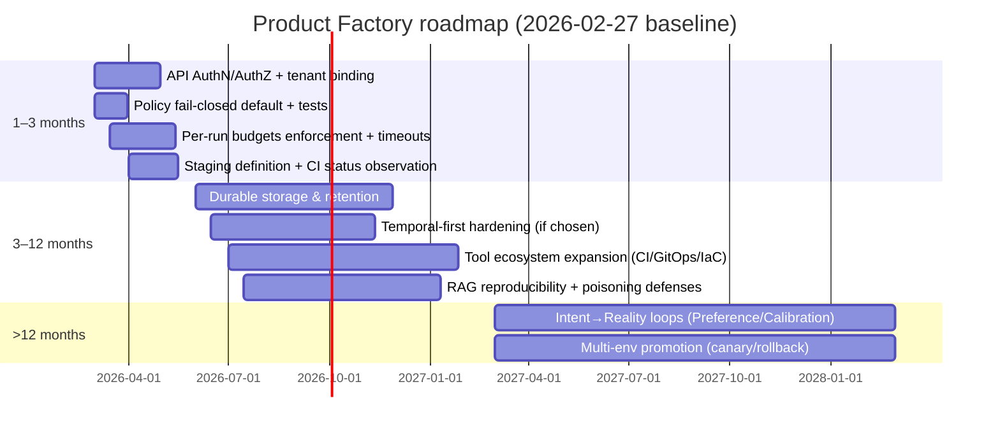

Я отвечу как всемирно известный эксперт по Software Architecture и DevSecOps, лауреат премии IEEE Computer Society Harlan D. Mills Award.

# Аналитический отчёт по Product Factory: соответствие документации и кода, пробелы, расхождения и дорожная карта

## Исполнительное резюме

Проект реализует «детерминированное ядро» фабрики (Control Plane), которое принимает продуктовый запрос через HTTP API, проводит базовую валидацию контрактов, выполняет policy-check (через OPA или fallback), инициирует агентный planning/codegen (через neural-сервис с fallback), а затем выполняет side-effects исключительно через Tool Executor (sandbox или docker-runner), фиксируя критические решения и результаты в audit log и artifact registry. Это соответствует заявленному принципу разделения Control Plane vs Intelligence Plane и модели «AI как генератор предложений, side-effects — только через инструменты + политики». Источники: docs/solution_design.md, docs/control-vs-intelligence-plane.md, src/main/kotlin/productfactory/workflow/WorkflowRunner.kt, src/main/kotlin/productfactory/workflow/FactoryWorkflowExecution.kt, src/main/kotlin/productfactory/workflow/tools/SandboxToolExecutor.kt.

Текущее состояние (по документации и структуре репозитория) близко к «закрытым» фазам Alpha/Beta/MVP/Scale: есть контракты и drift guard, state machine и workflow runner, API/CLI «self-serve», approvals/ask-user, интеграция с neural service, опциональный Temporal-режим, RAG-компоненты и CI policy-gates. Источники: docs/roadmap-checklist.md, README.md, src/main/kotlin/productfactory/cli/ProductFactoryCli.kt, .github/workflows/*, ci/*.

Ключевые технологические риски и зоны несоответствия (наиболее критичные):
- **Отсутствует AuthN/AuthZ на API**: multi-tenancy реализована как логическая изоляция по tenantId и scopedRunId, но без аутентификации это не является boundary безопасности; при публикации сервиса риск утечки/подмены операций высокий. Источники: src/main/kotlin/productfactory/api/FactoryApi.kt (tenantId), src/main/kotlin/productfactory/Application.kt (нет Ktor Authentication), docs/risk-register.md (Multi-tenancy), docs/threat_model.md.
- **Per-run бюджеты (token/toolcalls/wall_clock) описаны и присутствуют в модели запроса, но не enforced в workflow**: поле RunBudget есть, но механизм остановки/ограничения в WorkflowRunner/FactoryWorkflowExecution не найден. Источники: src/main/kotlin/productfactory/api/FactoryRunRequest.kt, docs/system-audit-corrective-plan.md, docs/alpha-sprint.md.
- **OPA policy работает, но режим fail-open — по умолчанию**, и при отсутствии OPA_URL запросы переходят в fallback-allow; это может противоречить заявленной security posture, если фабрика выходит за локальную песочницу. Источники: src/main/kotlin/productfactory/policy/PolicyCheck.kt, policies/opa/rego/factory.rego, docs/approval-policy.md.

Рекомендованный фокус ближайших 1–3 месяцев: превратить текущую «локально-доказуемую» систему в «безопасно-экспонируемую»: добавить AuthN/AuthZ и анти-абьюз, включить fail-closed по умолчанию для политики в прод-профиле, реализовать per-run budgets enforcement и тайм-ауты, а также явно согласовать в документации статус «боевого» staging/GitOps и зоны out-of-scope (remote-ssh executor, локальная pgvector-инфраструктура). Источники для опоры: docs/runbook.md, docs/approval-policy.md, docs/adr/0012-local-docker-and-remote-ssh-scope.md, docs/completion-pipeline.md, docs/risk-register.md, src/main/kotlin/productfactory/workflow/EnvironmentProvider.kt, src/main/kotlin/productfactory/api/FactoryApi.kt.

## База анализа и используемые первичные артефакты

Основные источники требований и намерений:
- PRD и архитектурные намерения: docs/PRD-factory.md, docs/solution_design.md, docs/architecture-and-path.md, docs/architecture-and-vision.md, docs/roadmap-workstreams-and-variants.md.
- Политики, безопасность, комплаенс и supply chain: docs/threat_model.md, docs/approval-policy.md, docs/secrets-policy.md, docs/adr/0011-sbom-signature-source-in-run.md, docs/adr/0013-release-sbom-signature-and-manual-high-risk-approval.md, policies/opa/rego/factory.rego, ci/release_policy_gate.py.
- Контракты и контроль дрейфа: contracts/schemas/*.json, docs/contract-drift-guard.md, src/main/kotlin/productfactory/contracts/*, .github/workflows/contracts-validation.yml.
- Операционные процессы: docs/runbook.md, docs/how-it-works-and-verify.md, docs/observability-and-logs.md, deploy/*.
- Аудит и автокомментарии: docs/audit-report-2026-02.md, docs/audit-response.md.
- Реализация: Kotlin/Gradle проект (build.gradle.kts), core API (src/main/kotlin/productfactory/api/FactoryApi.kt), workflow (src/main/kotlin/productfactory/workflow/*), tool executor (src/main/kotlin/productfactory/workflow/tools/*), neural integration (src/main/kotlin/productfactory/neural/*), RAG (src/main/kotlin/productfactory/rag/*), CLI (src/main/kotlin/productfactory/cli/*), CI (.[github]/workflows/*, ci/*).
- Верификация поведения через тесты: src/test/kotlin/productfactory/* (около 58 тестовых файлов) и Ktor test host.

Архитектурная схема по факту реализации (упрощённый вид, соответствующий референсу SDD):

```mermaid
flowchart LR
  U[Потребитель (CLI/HTTP)] --> API[API Gateway (Ktor)]
  API --> WR[WorkflowRunner + StateMachine]
  WR --> POL[PolicyCheck]
  POL -->|OPA_URL set| OPA[OPA service]
  POL -->|fallback| FB[Fallback allow/deny (fail mode)]
  WR --> AG[Agent Planner/Codegen]
  AG --> NEURAL[Neural Service Client]
  AG -->|optional| RAG[Planner Context Provider]
  RAG --> PG[(Postgres + pgvector)]
  WR --> TE[Tool Executor]
  TE --> SBX[Sandbox executor]
  TE --> DKR[DockerToolExecutor (опционально)]
  SBX --> GH[Git operations + repo bootstrap]
  SBX --> S3[(S3/MinIO artifact storage)]
  WR --> AUD[AuditLog]
  WR --> AR[ArtifactRegistry + Manifest]
  WR --> APPR[ApprovalStore]
  WR --> ASK[AskUserStore]
  WR --> MET[Metrics/PeriodUsage]
  WR -->|optional| TMP[Temporal worker/client]
```

Опора на код: src/main/kotlin/productfactory/Application.kt (маршруты, wiring компонентов, Temporal optional), src/main/kotlin/productfactory/api/FactoryApi.kt (эндпоинты), src/main/kotlin/productfactory/workflow/WorkflowRunner.kt и src/main/kotlin/productfactory/workflow/FactoryWorkflowExecution.kt (шаги), src/main/kotlin/productfactory/workflow/tools/SandboxToolExecutor.kt (side-effects), src/main/kotlin/productfactory/neural/* (LLM), src/main/kotlin/productfactory/rag/* (pgvector).

## Таблица сопоставления требований документации и статуса реализации

| requirement | doc reference | code module/file | implemented? | evidence | gap severity |
|---|---|---|---|---|---|
| Разделение Control Plane vs Intelligence Plane; side-effects только через Tool Executor + политики | docs/solution_design.md:L9<br>docs/control-vs-intelligence-plane.md:L1 | src/main/kotlin/productfactory/workflow/WorkflowRunner.kt; src/main/kotlin/productfactory/workflow/tools/*; src/main/kotlin/productfactory/agent/* | yes | src/main/kotlin/productfactory/workflow/WorkflowRunner.kt:L46<br>src/main/kotlin/productfactory/workflow/FactoryWorkflowExecution.kt:L114<br>src/main/kotlin/productfactory/workflow/tools/SandboxToolExecutor.kt:L44<br>src/main/kotlin/productfactory/agent/LlmAgentPlanner.kt:L29 | low |
| HTTP API gateway для запусков фабрики (+ health, metrics) | src/api/README.md:L1<br>docs/how-it-works-and-verify.md:L1 | src/main/kotlin/productfactory/api/FactoryApi.kt | yes | src/main/kotlin/productfactory/api/FactoryApi.kt:L562<br>src/main/kotlin/productfactory/api/FactoryApi.kt:L588<br>src/main/kotlin/productfactory/api/FactoryApi.kt:L610<br>src/main/kotlin/productfactory/api/FactoryApi.kt:L620<br>src/main/kotlin/productfactory/api/FactoryApi.kt:L1263 | low |
| Run input: goal, constraints, target_stack, dry_run, (budget: token/toolcalls/wall_clock) | docs/PRD-factory.md<br>docs/alpha-sprint.md<br>docs/system-audit-corrective-plan.md:L136 | src/main/kotlin/productfactory/api/FactoryRunRequest.kt; contracts/schemas/*.json | partial | src/main/kotlin/productfactory/api/FactoryRunRequest.kt:L10<br>src/main/kotlin/productfactory/api/FactoryRunRequest.kt:L23<br>contracts/schemas/constraints.schema.json<br>contracts/schemas/target_stack.schema.json | medium |
| Валидация YAML контрактов (contracts dir) перед выполнением workflow (fail fast) | docs/contract-drift-guard.md:L3<br>docs/runbook.md | src/main/kotlin/productfactory/contracts/ContractValidator.kt; src/main/kotlin/productfactory/workflow/FactoryWorkflowExecution.kt | yes | src/main/kotlin/productfactory/Application.kt:L175<br>src/main/kotlin/productfactory/workflow/FactoryWorkflowExecution.kt:L76<br>src/main/kotlin/productfactory/contracts/ContractValidator.kt:L16 | low |
| Contract Drift Guard (CLI) + CI артефакт отчёта | docs/contract-drift-guard.md:L79<br>.github/workflows/contracts-validation.yml | src/main/kotlin/productfactory/contracts/ContractDriftGuard.kt; src/main/kotlin/productfactory/contracts/ContractDriftGuardCli.kt; .github/workflows/contracts-validation.yml | yes | src/main/kotlin/productfactory/contracts/ContractDriftGuard.kt:L32<br>src/main/kotlin/productfactory/contracts/ContractDriftGuardCli.kt:L5<br>.github/workflows/contracts-validation.yml:L48<br>.github/workflows/contracts-validation.yml:L34 | low |
| Tool Registry как SSoT (schema-driven), risk tiers, allowed_secrets | contracts/tools.schema.json<br>contracts/tools.registry.json<br>docs/solution_design.md | src/main/kotlin/productfactory/workflow/tools/ToolRegistry.kt | yes | contracts/tools.schema.json<br>contracts/tools.registry.json<br>src/main/kotlin/productfactory/workflow/tools/ToolRegistry.kt:L25 | low |
| Tool call schema validation + idempotency at executor level | contracts/tools.schema.json<br>docs/solution_design.md | src/main/kotlin/productfactory/workflow/tools/SandboxToolExecutor.kt | yes | src/main/kotlin/productfactory/workflow/tools/SandboxToolExecutor.kt:L57<br>src/main/kotlin/productfactory/workflow/tools/SandboxToolExecutor.kt:L63<br>src/main/kotlin/productfactory/workflow/tools/SandboxToolExecutor.kt:L280 | low |
| Политики (OPA) для run/tool gating + endpoint /factory/policy-stats | policies/opa/README.md:L1<br>docs/approval-policy.md | src/main/kotlin/productfactory/policy/PolicyCheck.kt; policies/opa/rego/factory.rego; src/main/kotlin/productfactory/api/FactoryApi.kt | partial | src/main/kotlin/productfactory/policy/PolicyCheck.kt:L53<br>src/main/kotlin/productfactory/policy/PolicyCheck.kt:L15<br>policies/opa/rego/factory.rego<br>src/main/kotlin/productfactory/api/FactoryApi.kt:L650 | high |
| Human approvals: PENDING→APPROVED/REJECTED, API approve/reject, audit фиксация | docs/approval-policy.md:L1<br>docs/runbook.md | src/main/kotlin/productfactory/workflow/ApprovalStore.kt; src/main/kotlin/productfactory/api/FactoryApi.kt; src/main/kotlin/productfactory/workflow/FactoryWorkflowExecution.kt | yes | src/main/kotlin/productfactory/workflow/ApprovalStore.kt:L14<br>src/main/kotlin/productfactory/api/FactoryApi.kt:L1441<br>src/main/kotlin/productfactory/api/FactoryApi.kt:L1512<br>src/main/kotlin/productfactory/workflow/FactoryWorkflowExecution.kt:L565 | low |
| Ask-user механизм (вопрос→ответ) для уточнений; API /answer | docs/adr/0009-ask-user-contract-and-store.md<br>docs/runbook.md | src/main/kotlin/productfactory/workflow/AskUserStore.kt; src/main/kotlin/productfactory/api/FactoryApi.kt | yes | src/main/kotlin/productfactory/workflow/AskUserStore.kt:L12<br>src/main/kotlin/productfactory/api/FactoryApi.kt:L1531 | low |
| Audit Log: фиксирует решения/события/дигесты; recent events для decision-context | docs/observability-and-logs.md<br>docs/adr/0005-log-audit-trace-retention.md | src/main/kotlin/productfactory/workflow/AuditLog.kt; src/main/kotlin/productfactory/workflow/tools/SandboxToolExecutor.kt; src/main/kotlin/productfactory/api/FactoryApi.kt | yes | src/main/kotlin/productfactory/workflow/AuditLog.kt:L19<br>src/main/kotlin/productfactory/workflow/AuditLog.kt:L46<br>src/main/kotlin/productfactory/workflow/tools/SandboxToolExecutor.kt:L458<br>src/main/kotlin/productfactory/api/FactoryApi.kt:L1408 | medium |
| Artifact Registry + Artifact Manifest Contract (v1) и запись манифеста по состояниям | docs/artifact-manifest-contract.md:L1<br>docs/artifact-handoff-protocol.md:L1 | src/main/kotlin/productfactory/workflow/ArtifactRegistry.kt; src/main/kotlin/productfactory/workflow/ArtifactManifest.kt; src/main/kotlin/productfactory/workflow/FactoryWorkflowExecution.kt | yes | src/main/kotlin/productfactory/workflow/ArtifactRegistry.kt:L11<br>src/main/kotlin/productfactory/workflow/ArtifactManifest.kt:L12<br>src/main/kotlin/productfactory/workflow/FactoryWorkflowExecution.kt:L498<br>src/main/kotlin/productfactory/api/FactoryApi.kt:L1370 | low |
| Artifact Storage (S3/MinIO) для артефактов (репо-архив или comparable) | docs/runbook.md<br>deploy/docker-compose.yml:L1 | src/main/kotlin/productfactory/workflow/storage/S3ArtifactStorage.kt; deploy/docker-compose.yml; src/main/kotlin/productfactory/workflow/tools/SandboxToolExecutor.kt | partial | src/main/kotlin/productfactory/workflow/storage/S3ArtifactStorage.kt:L17<br>deploy/docker-compose.yml:L74<br>src/main/kotlin/productfactory/workflow/tools/SandboxToolExecutor.kt:L343 | medium |
| GitHub интеграция: создание репозитория + push | docs/github-setup.md<br>docs/example-scenario-full-run.md | src/main/kotlin/productfactory/workflow/tools/GitHubApiClient.kt; src/main/kotlin/productfactory/workflow/tools/SandboxToolExecutor.kt | yes | src/main/kotlin/productfactory/workflow/tools/GitHubApiClient.kt:L16<br>src/main/kotlin/productfactory/workflow/tools/SandboxToolExecutor.kt:L2940<br>src/main/kotlin/productfactory/workflow/tools/SandboxToolExecutor.kt:L2943 | low |
| Archetypes: минимум 1 архетип (API-service), репо создаётся из archetype | docs/PRD-factory.md<br>docs/archetypes-and-roadmap.md:L1 | archetypes/catalog-service; archetypes/web-app; src/main/kotlin/productfactory/workflow/tools/SandboxToolExecutor.kt | yes | archetypes/catalog-service/<br>archetypes/web-app/<br>src/main/kotlin/productfactory/workflow/tools/SandboxToolExecutor.kt:L3012 | low |
| Security checks (gitleaks/trivy) и фиксация результатов в audit | docs/threat_model.md<br>docs/completion-pipeline.md | src/main/kotlin/productfactory/workflow/SecurityRunner.kt; src/main/kotlin/productfactory/workflow/FactoryWorkflowExecution.kt | yes | src/main/kotlin/productfactory/workflow/SecurityRunner.kt:L31<br>src/main/kotlin/productfactory/workflow/SecurityRunner.kt:L69<br>src/main/kotlin/productfactory/workflow/FactoryWorkflowExecution.kt:L421 | medium |
| Supply chain версионирование (SBOM/подпись) + release-policy gate (CI) | docs/adr/0013-release-sbom-signature-and-manual-high-risk-approval.md:L1<br>docs/adr/0011-sbom-signature-source-in-run.md:L1 | src/main/kotlin/productfactory/workflow/SupplyChainVersionResolver.kt; ci/release_policy_gate.py; .github/workflows/release.yml | yes | src/main/kotlin/productfactory/workflow/SupplyChainVersionResolver.kt:L7<br>ci/release_policy_gate.py:L46<br>.github/workflows/release.yml:L96<br>.github/workflows/release.yml:L109 | low |
| RAG ingestion (pgvector) + planner context provider (feature-flag controlled) | docs/rag-pgvector-operations.md:L1<br>docs/runbook.md | src/main/kotlin/productfactory/rag/*; src/main/kotlin/productfactory/Application.kt | partial | src/main/kotlin/productfactory/rag/RagCli.kt:L10<br>src/main/kotlin/productfactory/rag/RagIngestionService.kt:L15<br>src/main/kotlin/productfactory/rag/RagPlannerContextProvider.kt:L16<br>src/main/kotlin/productfactory/Application.kt:L64 | medium |
| NEURAL_SERVICE_URL интеграция: LLM planner + codegen, fallback matrix | docs/neural-service-api.md:L1<br>docs/neural-service-operations.md:L1 | src/main/kotlin/productfactory/neural/*; src/main/kotlin/productfactory/agent/* | yes | src/main/kotlin/productfactory/neural/NeuralFallbackMatrix.kt:L12<br>src/main/kotlin/productfactory/agent/LlmAgentPlanner.kt:L46<br>src/main/kotlin/productfactory/agent/LlmAgentCodegen.kt:L21 | medium |
| Окружения выполнения: local-docker + remote-ssh abstraction (ADR-0012) | docs/adr/0012-local-docker-and-remote-ssh-scope.md:L1<br>docs/completion-pipeline.md:L25 | src/main/kotlin/productfactory/workflow/EnvironmentProvider.kt | partial | src/main/kotlin/productfactory/workflow/EnvironmentProvider.kt:L10<br>src/main/kotlin/productfactory/workflow/EnvironmentProvider.kt:L79<br>src/main/kotlin/productfactory/workflow/EnvironmentProvider.kt:L124 | high |
| Durable workflow execution через Temporal (опционально, профиль compose) | docs/runbook.md<br>deploy/docker-compose.yml:L1 | src/main/kotlin/productfactory/workflow/temporal/*; src/main/kotlin/productfactory/Application.kt | partial | src/main/kotlin/productfactory/Application.kt:L218<br>src/main/kotlin/productfactory/workflow/temporal/TemporalFactoryWorker.kt:L19<br>deploy/docker-compose.yml:L18 | medium |
| Observability: OpenTelemetry tracing + /metrics + readiness checks | docs/observability-and-logs.md<br>docs/runbook.md | src/main/kotlin/productfactory/observability/OpenTelemetryFactory.kt; src/main/kotlin/productfactory/Application.kt; src/main/kotlin/productfactory/api/FactoryApi.kt | yes | src/main/kotlin/productfactory/observability/OpenTelemetryFactory.kt:L11<br>src/main/kotlin/productfactory/Application.kt:L292<br>src/main/kotlin/productfactory/api/FactoryApi.kt:L620<br>src/main/kotlin/productfactory/api/FactoryApi.kt:L588 | medium |
| Profile store (embedding + rules) с consent и endpoints PUT/GET/DELETE/reset/incognito | docs/profile-store.md:L18 | src/main/kotlin/productfactory/profile/ProfileStore.kt; src/main/kotlin/productfactory/api/FactoryApi.kt | yes | src/main/kotlin/productfactory/profile/ProfileStore.kt:L55<br>src/main/kotlin/productfactory/api/FactoryApi.kt:L703<br>src/main/kotlin/productfactory/api/FactoryApi.kt:L808<br>src/main/kotlin/productfactory/api/FactoryApi.kt:L835 | medium |
| Intent/Experience API (POST /intent/estimate, /experience/generate) + единый формат ошибок | docs/api-intent-experience.md:L11 | src/main/kotlin/productfactory/api/FactoryApi.kt; src/main/kotlin/productfactory/intent/* | yes | src/main/kotlin/productfactory/api/FactoryApi.kt:L903<br>src/main/kotlin/productfactory/api/FactoryApi.kt:L1058<br>src/main/kotlin/productfactory/api/FactoryApi.kt:L380<br>src/main/kotlin/productfactory/intent/LlmIntentCandidatesGenerator.kt:L18 | medium |
| Multi-tenancy: валидация tenantId, scopedRunId, tenant isolation тестами | docs/risk-register.md:L10 | src/main/kotlin/productfactory/api/FactoryApi.kt; src/test/kotlin/productfactory/TenantIsolationApiTest.kt | partial | src/main/kotlin/productfactory/api/FactoryApi.kt:L88<br>src/main/kotlin/productfactory/api/FactoryApi.kt:L105<br>src/test/kotlin/productfactory/TenantIsolationApiTest.kt:L17 | high |
| CLI self-serve: run/status/intent + contract validate/drift-guard + rag + adr-draft | docs/runbook.md | src/main/kotlin/productfactory/cli/ProductFactoryCli.kt; src/main/kotlin/productfactory/cli/FactoryConsumerCli.kt | yes | src/main/kotlin/productfactory/cli/ProductFactoryCli.kt:L11<br>src/main/kotlin/productfactory/cli/ProductFactoryCli.kt:L49<br>src/main/kotlin/productfactory/cli/ProductFactoryCli.kt:L52<br>src/main/kotlin/productfactory/cli/ProductFactoryCli.kt:L54 | low |
| Decision context: API /factory/runs/{runId}/decision-context (+ UI endpoint /factory/ui) | docs/completion-pipeline.md:L44 | src/main/kotlin/productfactory/api/FactoryApi.kt | partial | src/main/kotlin/productfactory/api/FactoryApi.kt:L673<br>src/main/kotlin/productfactory/api/FactoryApi.kt:L1391<br>src/main/kotlin/productfactory/api/FactoryApi.kt:L76 | medium |
| Promotion signals / SLO gate evaluation (allow/review/block) как отдельный gate | docs/completion-pipeline.md:L10 | src/main/kotlin/productfactory/api/FactoryApi.kt; ci/slo_gate.py; src/main/kotlin/productfactory/workflow/FactoryWorkflowExecution.kt | partial | src/main/kotlin/productfactory/api/FactoryApi.kt:L1558<br>ci/slo_gate.py:L22<br>src/main/kotlin/productfactory/workflow/FactoryWorkflowExecution.kt:L466 | medium |
| Per-run budgets enforcement (token/toolcalls/wall_clock) как элемент governance | docs/system-audit-corrective-plan.md:L379 | src/main/kotlin/productfactory/api/FactoryRunRequest.kt; (enforcement отсутствует) | no | src/main/kotlin/productfactory/api/FactoryRunRequest.kt:L23<br>Repo search: tokenBudget/toolCallsBudget/wallClockSeconds не используются вне FactoryRunRequest.kt | high |
| AuthN/AuthZ для API (минимум: защита multi-tenant boundary, anti-abuse) | docs/threat_model.md:L1 | src/main/kotlin/productfactory/Application.kt; src/main/kotlin/productfactory/api/FactoryApi.kt | no | src/main/kotlin/productfactory/Application.kt:L182<br>Отсутствуют Ktor plugins Authentication/Authorization в src/main/kotlin/productfactory/Application.kt | high |

## Отсутствующие функции и варианты реализации

Ниже — перечень функциональностей, которые явно подразумеваются документами (или вытекают из стратегии безопасности/эксплуатации), но сейчас отсутствуют либо реализованы частично. Для каждой — 2 конкретных варианта следующего шага с плюсами/минусами и оценкой трудоёмкости.

| Missing feature | Option | Pros | Cons | Effort |
|---|---|---|---|---|
| AuthN/AuthZ для API (tenant boundary должен быть security boundary) | Вариант A: Ktor Authentication (JWT/OIDC) на уровне сервиса | Прозрачная интеграция, стандартные механизмы ролей/claims, масштабирование в multi-tenant | Требует провайдера токенов, жизненного цикла ключей, тестов и runbook; усложняет локальный запуск | medium |
| AuthN/AuthZ для API | Вариант B: reverse-proxy/gateway auth (mTLS/API key на ingress) + Ktor только валидирует tenant mapping | Быстрое внедрение, минимальные изменения в коде; удобно для частных сред | Сложнее валидировать «кто именно принял решение» в audit; риск расхождения конфигураций ingress и сервиса | low–medium |
| Per-run budgets enforcement (token/toolcalls/wall_clock) | Вариант A: enforcement в WorkflowRunner/FactoryWorkflowExecution (счётчики tool calls, тайм-аут step-ов, лимит LLM tokens) | Прямое соответствие модели RunBudget; контролируемая стоимость; проще сопровождать | Нужно аккуратно связать реальный token usage из neural ответа с бюджетом; понадобится протокол отмены/прерывания | medium |
| Per-run budgets enforcement | Вариант B: rely-on durable engine (Temporal timeouts + activity retry policy + cancellation) | «Правильная» operational модель: timeouts, retries, cancels, история; лучше для production | Необходим перевод в Temporal-first режим; выше сложность и инфраструктурные затраты | high |
| OPA policy: fail-closed по умолчанию в production профиле | Вариант A: поменять default режим на CLOSED, OPEN оставить только для dev (env profile) | Сильное усиление security posture; упрощает объяснимость для аудита | Может ломать локальные запуски без OPA; нужна документация профилей и feature flags | low |
| OPA policy: богаче PolicyInput | Вариант B: расширить PolicyInput (tenantId, target_stack, risk tiers, tool metadata, budgets, environment type) | Политика сможет отражать реальные риски и контекст; лучше для multi-tenancy и compliance | Требует пересмотра contracts, rego, тестов и обратной совместимости | medium |
| Remote SSH execution: фактическое выполнение tool calls в remote окружении | Вариант A: реализовать SSH runner внутри ToolExecutor (upload workspace, run commands/tools, collect artifacts) | Прямая реализация ADR-0012; полезно для «белого» production окружения | Сложно безопасно; нужны hardening, секреты, sandboxing на удалённом хосте, контроль дрейфа окружения | high |
| Remote SSH execution | Вариант B: отдельный remote-runner service/agent (pull model) + фабрика только оркестрирует | Лучше с точки зрения безопасности и масштабирования; можно жёстко ограничить права runner-а | Потребует отдельного сервиса/деплоя/наблюдаемости; увеличивает операционную стоимость | high |
| Durable storage & retention для audit/approvals/registry/profile | Вариант A: PostgreSQL (таблицы: runs, events, approvals, questions, profiles, manifests) | Поиск/фильтрация, retention policies, multi-tenant по схемам/partitioning, производительность | Миграции, эксплуатация, бэкапы; надо согласовать модель данных с документами | high |
| Durable storage & retention | Вариант B: оставить JSONL/файлы, но добавить индексацию и ротацию (size/time), плюс подписывание audit chunks | Низкий порог изменений; быстрее внедрить; лучше, чем «вечный файл» | Ограниченная аналитика; сложнее обеспечить строгую целостность и удобный аудит при росте нагрузки | medium |
| CI/CD bootstrap в генерируемом репозитории (обещание «repo → CI → staging») | Вариант A: добавить в archetypes минимальные workflows (.github/workflows/ci.yml, security scan) | Реально «самодостаточный репозиторий» после генерации; меньше ручной работы | Нужно поддерживать версии actions, политики, секреты; повышает связность | medium |
| CI/CD bootstrap | Вариант B: фабрика применяет patch после создания репо (tool apply_patch) и добавляет workflows динамически | Гибче: можно выбирать pipeline по target_stack/risk | Требует более сложного planner/codegen + политики high-risk для добавления CI/CD | medium–high |
| «Staging» как реальный этап (а не только artifact registry update) | Вариант A: трактовать staging как внешний процесс (GitHub Actions в generated repo) и добавить наблюдение/ожидание статуса checks | Минимум изменений в инфраструктуре; хорошо ложится на текущий GitHub flow | Нужно API-интеграция для чтения статусов checks и тайм-ауты; усложняет permissions | medium |
| «Staging» как реальный этап | Вариант B: GitOps (Argo/Flux): фабрика пишет desired state в отдельный репо, окружение само применяет | Сильная operability модель, быстрый rollback, декларативность | Появляется второй репозиторий и контур доступа; выше порог внедрения | high |
| RAG: локальная воспроизводимость (pgvector окружение для dev/CI) | Вариант A: добавить сервис Postgres+pgvector в deploy/docker-compose.yml (dev profile) | Быстрые локальные проверки; детерминируемая среда для CI | Усложняет compose стек; надо документировать профили и ресурсы | medium |
| RAG: локальная воспроизводимость | Вариант B: оставить внешний pgvector, но добавить «операционный контракт» (healthcheck, миграции, smoke ingestion) | Меньше кода/инфры внутри репо; лучше подходит для корпоративных баз | Низкая «из коробки» воспроизводимость; выше барьер входа | low–medium |

Отдельно стоит отметить, что уже реализованы «вспомогательные» элементы для части этих пунктов: например, remote-ssh EnvironmentProvider присутствует как поставщик контекста, но не как фактический executor (src/main/kotlin/productfactory/workflow/EnvironmentProvider.kt). Аналогично, promotion signals и SLO-gate существуют как отдельные механизмы (/factory/promotion/{runId}/evaluate, ci/slo_gate.py), но не встроены как обязательный шаг «promote to prod» в orchestration (src/main/kotlin/productfactory/api/FactoryApi.kt, src/main/kotlin/productfactory/workflow/FactoryWorkflowExecution.kt).

## Расхождения между кодом и документами: влияние и исправления

Ниже — список расхождений, сгруппированный по типам (функциональные, архитектурные, API, модель данных, security, performance). Формулировки опираются на обнаруженные интерфейсы и реализацию.

Функциональные
- Per-run budgets присутствуют в API модели (RunBudget), но не применяются при выполнении run. Влияние: риск неконтролируемого расхода токенов/времени/вызовов tools при включённом neural-сервисе и при расширении toolset. Исправление: реализовать enforcement в WorkflowRunner/FactoryWorkflowExecution и/или вынести в Temporal timeouts; дополнить audit событиями budget_exceeded. Источники: src/main/kotlin/productfactory/api/FactoryRunRequest.kt, src/main/kotlin/productfactory/workflow/WorkflowRunner.kt, docs/system-audit-corrective-plan.md.
- «Staging» в текущем ядре фиксируется как событие + artifact registry update, но отсутствует явная интеграция с деплоем (GitOps/CD) внутри workflow. Влияние: док-обещание «репо → CI → staging» зависит от внешнего контура; контроль завершения стейджа не гарантирован. Исправление: либо явно задекларировать external staging (и добавить наблюдение статусов checks), либо реализовать GitOps шаг. Источники: docs/PRD-factory.md, src/main/kotlin/productfactory/workflow/FactoryWorkflowExecution.kt (executeStage), docs/completion-pipeline.md.

Архитектурные
- PolicyCheck имеет fallback поведение при отсутствии OPA_URL и по умолчанию находится в режиме fail-open (если POLICY_FAIL_MODE не задан как closed). Влияние: политика становится «best-effort», а не обязательным guardrail; при расширении tool registry это превращается в системную уязвимость. Исправление: изменить default на fail-closed в production профиле, явно документировать dev profile; добавить тест «no OPA → denied» для prod режима. Источники: src/main/kotlin/productfactory/policy/PolicyCheck.kt, policies/opa/rego/factory.rego, docs/approval-policy.md.
- Remote SSH присутствует как тип окружения и провайдер параметров, но фактического исполнения через SSH в ToolExecutor не видно. Влияние: ADR-0012 выполняется частично; ожидания эксплуатации в «удалённом» окружении могут быть завышены. Исправление: либо реализовать SSH executor, либо чётко пометить в docs как out-of-scope/disabled, завязав на feature flag. Источники: docs/adr/0012-local-docker-and-remote-ssh-scope.md, src/main/kotlin/productfactory/workflow/EnvironmentProvider.kt.

API
- Требования multi-tenancy частично реализованы на уровне параметров tenantId и scopedRunId; однако без AuthN/AuthZ tenantId не является защищённым атрибутом. Влияние: при экспонировании API любой клиент сможет читать/влиять на чужие run-артефакты, угадав runId и указав tenantId. Исправление: внедрить аутентификацию и связку «identity → tenant», добавить audit поля decidedBy/identity, добавить rate-limit. Источники: src/main/kotlin/productfactory/api/FactoryApi.kt (resolveTenantId, scopedRunId), docs/risk-register.md, docs/threat_model.md.
- Decision-context реализован отдельно от основного get-run; документация (completion pipeline) говорит о «веб-форме решений», но текущий UI эндпоинт /factory/ui вероятно минималистичен и не покрывает «принятие решений» полноценно. Влияние: UX для approvals/ask-user может быть ниже заявленного, если CLI не используется. Исправление: расширить /factory/ui до минимального decision console или явно обозначить «UI optional». Источники: docs/completion-pipeline.md, src/main/kotlin/productfactory/api/FactoryApi.kt (/factory/ui, /decision-context).

Модели данных и контракты
- Контрактная система присутствует и проверяет YAML документы в каталоге contracts, но критично важно согласовать, что именно относится к «входным контрактам» для run и что относится к «контрактам качества/рисков/стека»; в текущем коде validateContractsIfConfigured валидирует весь каталог contractsDirectory без явного выбора subset per run. Влияние: возможны «ложные отклонения» run из-за нерелевантных контрактов в каталоге. Исправление: добавить режимы валидации (subset per request или явное перечисление), либо разделить каталоги contracts (input vs system). Источники: src/main/kotlin/productfactory/workflow/FactoryWorkflowExecution.kt (validateContractsIfConfigured), src/main/kotlin/productfactory/contracts/ContractValidator.kt, docs/contract-drift-guard.md.
- RAG компоненты есть, но для «из коробки» воспроизводимости не видно локального pgvector окружения в deploy/docker-compose.yml; при этом docs описывают операции ingestion и включение флага. Влияние: повышается барьер входа и риск «работает только в одной среде». Исправление: добавить dev profile для pgvector или добавить более жёсткий preflight check с понятным сообщением. Источники: docs/rag-pgvector-operations.md, src/main/kotlin/productfactory/rag/*, deploy/docker-compose.yml.

Security
- Отсутствие AuthN/AuthZ — наиболее критичное (см. выше).
- Audit log и artifact registry в файловом виде требуют чёткой политики хранения/ротации и защиты от подмены. Документы ADR о retention указывают на необходимость управления жизненным циклом логов. Влияние: риск утраты доказательств, рост диска, сложности расследований. Исправление: добавить ротацию/архивацию, подпись чанков, или переход на БД/объектное хранилище с WORM-подходом. Источники: docs/adr/0005-log-audit-trace-retention.md, src/main/kotlin/productfactory/workflow/AuditLog.kt, src/main/kotlin/productfactory/workflow/ArtifactRegistry.kt.
- Policy input для OPA включает только ключи аргументов tool call, а не значения; это хорошая практика, но нужно удостовериться, что ToolExecutor не логирует значения секретов. Сейчас logging tool input заменён на digest, что соответствует требованиям «не лить секреты». Влияние: позитивное; зона риска — расширение tool executors. Исправление: зафиксировать контракт: «в audit логируем только digest + allowlisted вывод». Источники: src/main/kotlin/productfactory/workflow/tools/SandboxToolExecutor.kt (logToolCall), docs/secrets-policy.md.

Performance/надежность
- FileAuditLog.recentEvents потенциально читает файл (JSONL) и может деградировать при росте объёма. Влияние: /decision-context и другие операции чтения будут медленнее, возможны timeouts. Исправление: инкрементальная индексация, ротация, или переход на storage с индексами. Источники: src/main/kotlin/productfactory/workflow/AuditLog.kt.
- SecurityRunner запускает внешние команды и использует stdout/stderr, обрезая вывод; для больших репозиториев может быть медленно и ресурсоёмко. Влияние: рост времени runs, потенциальные out-of-memory при больших выводах (хотя ввод ограничен). Исправление: streaming processing логов, тайм-ауты, вынесение в контейнерный runner. Источники: src/main/kotlin/productfactory/workflow/SecurityRunner.kt, docs/threat_model.md.

## Миссия, стратегический вектор и оценка прогресса с KPI

Миссия проекта (по документам и факту реализации): «Получая намерение пользователя, фабрика создаёт deployable-артефакт (репозиторий с кодом и сопутствующими артефактами) через строго детерминированный контур оркестрации, где AI-компоненты используются как proposal engine, а все side-effects выполняются только через контрактные инструменты, политики, approvals и аудируемый след». Источники: docs/PRD-factory.md, docs/solution_design.md, docs/strategy-differentiation-kernel-plugins.md, README.md, src/main/kotlin/productfactory/workflow/*.

Стратегический вектор развития виден в двух «слоях дорожной карты»:
- Локальная «Product Factory» как Artifact Runtime (создание репозиториев/кода, управляемые инструменты, supply chain).
- Более широкий Intent→Reality roadmap (workstreams WS0–WS4: intent layer, preference model, роли, окружения и т.д.). Источники: docs/roadmap-workstreams-and-variants.md.

Оценка прогресса по milestone-логике, исходя из репозитория:
- Alpha: контракты и схемы + contract validation/drift guard присутствуют (contracts/schemas/*.json, docs/contract-drift-guard.md, src/main/kotlin/productfactory/contracts/*, .github/workflows/contracts-validation.yml).
- Beta: минимальное детерминированное ядро — WorkflowRunner, state machine, audit, policy-check, approvals/ask-user есть (src/main/kotlin/productfactory/workflow/*, policies/opa/*, docs/approval-policy.md).
- MVP: инструментальный контур side-effects реализован в sandbox executor с базовыми tool calls + GitHub/артефактное хранилище, есть API /factory/run и consumer CLI (src/main/kotlin/productfactory/workflow/tools/SandboxToolExecutor.kt, src/main/kotlin/productfactory/api/FactoryApi.kt, src/main/kotlin/productfactory/cli/*, deploy/docker-compose.yml).
- Scale: интеграция с LLM/neural и частично RAG, плюс gates/evals вокруг (src/main/kotlin/productfactory/agent/*, src/main/kotlin/productfactory/neural/*, src/main/kotlin/productfactory/rag/*, ci/quality_gates.py).

Предлагаемый набор KPI, который логично продолжает уже имеющиеся метрики и документы:
- Delivery: доля run со статусом accepted vs rejected (уже поддержано через FactoryMetrics: src/main/kotlin/productfactory/observability/FactoryMetrics.kt, /metrics: src/main/kotlin/productfactory/api/FactoryApi.kt).
- Latency: p95/p99 wall time одного run и отдельных подпроцессов (agent planner/codegen, tool executor, security checks). Частично поддержано через OpenTelemetry spans и метрики LLM calls (src/main/kotlin/productfactory/observability/OpenTelemetryFactory.kt, src/main/kotlin/productfactory/observability/FactoryMetrics.kt).
- Governance: доля runs, ушедших в approvals/ask-user; среднее время до решения (approval latency/answer latency) — нужно добавить timestamping в audit/records.
- Policy quality: доля deny по OPA (policy deny share), частота fallback режимов (OPA down, neural fallback). Частично есть policy-stats и fallback матрица.
- Cost: weekly/monthly usage counters (runs/tokens/tool_calls) и нарушение cost budgets (src/main/kotlin/productfactory/workflow/CostBudgets.kt, src/main/kotlin/productfactory/api/FactoryApi.kt).
- Supply chain: доля runs с DONE manifest и наличием sbom/signature версий в manifest/registry (src/main/kotlin/productfactory/workflow/ArtifactManifest.kt, src/main/kotlin/productfactory/workflow/SupplyChainVersionResolver.kt).
- Regression gates: pass_rate/average_score по offline evals (ci/quality_gates.py, eval/*).

Индикаторы «скорости» прямо из репозитория (как proxy, пока нет issue tracker/коммит-аналитики в этом пакете):
- Объём тестового покрытия API/ядра: около 58 тестовых файлов (src/test/kotlin/productfactory/*).
- CI workflows: минимум 5 workflow файлов в .github/workflows (ci.yml, release.yml, contracts-validation.yml и др.), плюс отдельные скрипты gates в ci/*.  
- Документация: более 100 markdown документов, включая ADR, runbook, threat model, risk register, аудиты (docs/*).  

## Приоритезированная дорожная карта и реестр рисков

Рекомендованная дорожная карта (ориентиры по срокам, без привязки к конкретному трекеру)

Короткий горизонт 1–3 месяца
- Security boundary для multi-tenancy: внедрить AuthN/AuthZ (JWT/OIDC или ingress auth), связать identity→tenant, добавить rate limiting и audit атрибуты «кто принял решение» (decidedBy/identity). Опора: src/main/kotlin/productfactory/api/FactoryApi.kt (tenant), docs/risk-register.md.
- Переключить policy posture: default fail-closed в production профиле, зафиксировать dev-профиль (fail-open допустим только явно). Добавить тесты и runbook секцию. Опора: src/main/kotlin/productfactory/policy/PolicyCheck.kt, policies/opa/rego/factory.rego, docs/approval-policy.md.
- Реализовать per-run budgets enforcement (token/toolcalls/wall_clock) и тайм-ауты шагов (включая безопасность для external команд SecurityRunner). Опора: src/main/kotlin/productfactory/api/FactoryRunRequest.kt, src/main/kotlin/productfactory/workflow/*.
- Уточнить «staging» как продуктовую гарантию: либо встроить ожидание CI checks в workflow (GitHub API клиент), либо обозначить это как внешний контур и обеспечить наблюдение статусов на /decision-context. Опора: docs/PRD-factory.md, docs/runbook.md, src/main/kotlin/productfactory/api/FactoryApi.kt.
- Согласовать документацию и «status truth»: обновить docs/roadmap-checklist.md и docs/audit-response.md с явным статусом: что закрыто полностью, что «закрыто как MVP» и требует hardening.

Средний горизонт 3–12 месяцев
- Durable storage для audit/registry/approvals/ask-user/profiles с retention и поиском (предпочтительно PostgreSQL), или как промежуточная мера — ротация/индексация JSONL и подпись чанков audit. Опора: docs/adr/0005-log-audit-trace-retention.md, src/main/kotlin/productfactory/workflow/AuditLog.kt.
- Temporal-first режим (если выбран как стратегия): сделать Temporal основным execution backend, определить policies retries/timeouts/cancellation, обеспечить операционные runbooks. Опора: src/main/kotlin/productfactory/workflow/temporal/*, deploy/docker-compose.yml.
- Увеличение tool ecosystem: расширить tool registry и sandbox/docker executors (security-aware) для CI/CD bootstrap, GitOps, IaC генерации, проверки статусов и promotion. Опора: contracts/tools.registry.json, src/main/kotlin/productfactory/workflow/tools/*, docs/strategy-differentiation-kernel-plugins.md.
- RAG hardening: обеспечить воспроизводимый pgvector контур (dev profile, миграции, smoke ingestion), меры против RAG poisoning (allowlist источников, хэши/версии), измерения качества. Опора: docs/rag-pgvector-operations.md, src/main/kotlin/productfactory/rag/*, eval/*.

Длинный горизонт >12 месяцев
- Переход к «Intent→Reality» петлям: Preference Model 1.0, calibration loop, роли/окружения/мульти-агенты, расширение runtime за пределы «artifact factory» (видео/стрим runtime и т.п., если это соответствует стратегии). Опора: docs/roadmap-workstreams-and-variants.md.
- Продакшен-градация environments: полноценный remote-ssh (или альтернативный remote runner backend), multi-environment promotion до prod с canary и быстрым rollback. Опора: docs/adr/0012-local-docker-and-remote-ssh-scope.md, docs/runbook.md.

План-график (укрупнённо)



Реестр рисков (прикладной, с митигациями; дополняет docs/risk-register.md и docs/threat_model.md)

| Risk | Impact | Likelihood | Early signals | Mitigation |
|---|---|---|---|---|
| Отсутствие AuthN/AuthZ при multi-tenancy | Very high (cross-tenant access, подмена approvals/answers) | High при экспонировании API | Неожиданные обращения к runId/tenantId, рост 404/403, инциденты доступа | Ввести AuthN/AuthZ, связать identity→tenant, rate-limit, подписывать решения (audit), ограничить сетью |
| Policy fail-open (OPA недоступен → allow) | High (обход governance) | Medium | OPA_URL не задан, частые fallback события, policy-stats не отражает deny | Default fail-closed (prod), health gating readiness на OPA, алерты |
| Нет per-run budgets enforcement | High (cost blow-up, зависания, неконтролируемые tool calls) | Medium–High при LLM enabled | Рост llm tokens, долгие runs, timeouts, переполнение логов | Реализовать budgets/timeouts, cancellation, SLO gate |
| File-based audit/registry без ротации | Medium–High (диск, потеря доказательств, медленные выборки) | Medium | Рост audit.log, замедление decision-context/recentEvents | Ротация + индекс или переход на PostgreSQL/объектное хранилище |
| Remote execution не завершён (remote-ssh частичный) | Medium (застревание roadmap environments) | Medium | Требования production окружений, невозможность запускать tools | Реализовать SSH executor или отдельный runner service |
| Supply chain компрометация артефактов | High | Low–Medium | Несоответствие sbom/signature, нарушения release gate | Жёсткий release-policy gate, подпись, проверка артефактов, immutable digests |
| RAG poisoning / неверный контекст | Medium–High | Medium | Резкое падение eval метрик, некорректные выводы planner | Allowlist источников, версионирование индекса, хэши, quality_gates в CI |
| Tool ecosystem расширяется без security review | High | Medium | Появляются инструменты с write/publish эффектами без approvals | Регламент: новые tools только через registry+OPA+approval policy; тесты и threat review |
| Performance деградация на больших runs (security scans, audit чтение) | Medium | Medium | Рост p99, timeouts, увеличение ресурсов | Timeouts, streaming logs, вынесение scans в контейнер/runner, хранилище с индексами |
| «Staging» остаётся декларативным без проверки | Medium | Medium | Репо создано, но CI не проходит/деплой не происходит | Наблюдение статусов checks, обязательный smoke gate, явная постановка ответственности |

Ссылки на первичные «реестры рисков» и соответствующие документы: docs/risk-register.md, docs/threat_model.md, docs/approval-policy.md, policies/opa/rego/factory.rego, ci/release_policy_gate.py, docs/adr/0013-release-sbom-signature-and-manual-high-risk-approval.md.