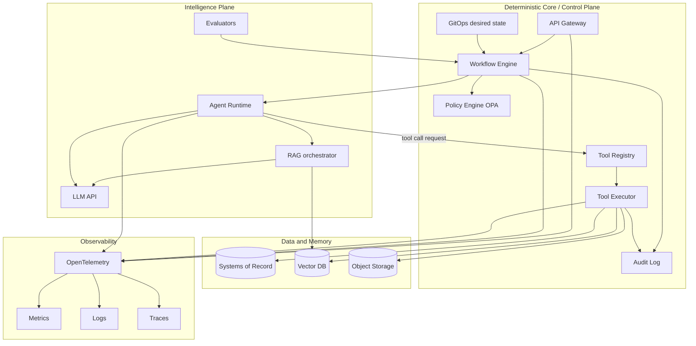

# Solution Design (SDD): Product Factory

Фаза 2. Архитектура платформы: разделение детерминированного и недетерминированного слоёв, компоненты, потоки.

Источник: [deep-research-report-4.md](../deep-research-report-4.md), раздел «Референс-архитектуры».

---

## 1. Принцип: Control Plane vs Intelligence Plane

- **Детерминированный слой (Control Plane):** оркестрация, политики, реестр инструментов, исполнение tools (sandbox), аудит, desired state. Всё воспроизводимо и версионируемо.
- **Недетерминированный слой (Intelligence Plane):** агент, LLM, RAG, эвалюаторы. Агент только генерирует артефакты (спеки, планы, код); все side-effects — через Tool Registry и Tool Executor по контракту.

---

## 2. Референс-архитектура

---

## 3. Компоненты

| Компонент | Назначение |
|-----------|------------|
| **API Gateway** | Точка входа для product request; проверка аутентификации, rate limit; передача в Workflow. |
| **Workflow Engine** | Durable execution (Temporal или аналог). Запуск сценария фабрики, вызов агента, вызов Tool Executor по заявкам агента, восстановление после сбоев. |
| **Policy Engine (OPA)** | Проверка перед каждым tool call: allowlist, бюджеты, risk tier; решение «разрешить / требовать approval». |
| **Tool Registry** | Версионируемый реестр инструментов (JSON schema): name, risk_tier, requires_human_approval, idempotency, timeouts, retry_policy, input/output schema. |
| **Tool Executor** | Исполнение вызова в sandbox: минимальные права, секреты через брокер, идемпотентность, ретраи; запись в Audit Log. |
| **Audit Log / Event Store** | Все события: запросы, tool calls, решения policy, результаты. Для расследований и комплаенса. |
| **Agent Runtime** | Оркестрация LLM: генерация спека/плана/задач в structured form; запросы к Tool Registry на выполнение действий; без прямых side-effects. |
| **LLM** | Генерация текста/структур (PRD, ADR, код) по контракту structured outputs. |
| **RAG** | Поиск по индексу (pgvector и др.), упаковка контекста для LLM. Фаза 4+. |
| **Evaluators** | Offline/online eval, trace grading. Фаза 5+. |
| **GitOps (desired state)** | Репозиторий(и) окружений; деплой по коммиту. |
| **Observability** | OTel: метрики, логи, трейсы в выбранный backend. |

---

## 4. Поток одного factory run

1. **User** → Gateway: product request (goal + constraints).
2. **Gateway** → Workflow: старт workflow.
3. **Workflow** → Policy: проверка бюджетов, risk tier; при необходимости запрос human approval.
4. **Workflow** → Agent: сгенерировать spec + plan + task graph (structured).
5. **Agent** → LLM/RAG: генерация; Agent → Workflow: структурированный результат.
6. **Workflow** → Tool Registry + Policy: проверка вызовов; при разрешении → Tool Executor.
7. **Tool Executor** → Repo/CI/Storage: создание репо, коммиты, вызов CI; все вызовы в Audit Log.
8. **Workflow** → GitOps: деплой в staging.
9. **Workflow** → User: результат (URL репо, статус, отчёты).

Детали по этапам и задачам: [automated-development-model.md](automated-development-model.md).

---

## 5. Решения по реализации (MVP)

- Workflow: см. [ADR-0001](adr/0001-stack-and-prerequisites.md) (Temporal или аналог).
- Политики: OPA, правила в `policies/opa/rego/`, конфиг бюджетов/allowlist в `policies/`.
- Контракты: [contracts/tools.schema.json](../contracts/tools.schema.json), [contracts/agent_outputs.schema.json](../contracts/agent_outputs.schema.json).
- Список tools для MVP: [tools-list-mvp.md](tools-list-mvp.md). Политика approvals: [approval-policy.md](approval-policy.md).
