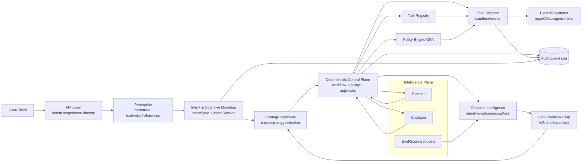

# План технологий и реализации Product Factory

Этот документ объединяет технологические и архитектурные решения, детальный план работ и операционную модель внедрения Product Factory в единую исполнимую рамку. Цель документа — дать согласованный ориентир для перехода от текущего состояния к устойчивому контуру `Intent -> Reality` с явными границами между Intelligence и Control, контролем рисков и проверяемыми критериями готовности.

В основе плана: [architecture-and-path.md](architecture-and-path.md), [solution_design.md](solution_design.md) и [roadmap-workstreams-and-variants.md](roadmap-workstreams-and-variants.md). При объединении сохранены исходные технические решения по стеку, архитектуре, backlog-фазам и эксплуатации.

План адресован инженерам платформы, архитекторам, владельцам продукта и операционным ролям (SRE/безопасность/approvers), которым нужен единый источник для проектирования, реализации, запуска и контроля изменений.

## Оглавление

- [1. Технологический стек](#section-1)
- [2. Архитектура и компоненты](#section-2)
- [3. Детальный план задач](#section-3)
- [4. Интеграция и эксплуатация](#section-4)

# 1. Технологический стек

Этот раздел фиксирует базовый технологический стек Product Factory для движения по целевой структуре `Intent -> Reality` (см. [architecture-and-path.md](architecture-and-path.md), [roadmap-workstreams-and-variants.md](roadmap-workstreams-and-variants.md)). Принцип неизменен: **control/intelligence separation**, policy-first, explicit contracts, budget enforcement и human override.

Стек ниже ограничен зрелыми open-source технологиями и выбран так, чтобы избежать vendor lock-in: для каждого ключевого компонента указаны реалистичные альтернативы (1-2), которые можно включать без пересборки всей архитектуры.

## 1.1 Слойная карта стека (базовый выбор + альтернативы)

| Слой/компонент | Основная технология | Альтернативы (switch-ready) | Краткое обоснование |
|---|---|---|---|
| **Perception**: текстовый и событийный вход | Kotlin (JDK 17) + Ktor 2.3+ (`intent`/`factory` API) | Go + Gin/Fiber; Java + Spring Boot | Текущий core уже на Kotlin/Ktor; минимальные риски для H1 (надёжность, контракты, audit). |
| **Perception**: voice ingestion (ASR pipeline) | Whisper.cpp (self-hosted) | Vosk; Coqui STT | Зрелые OSS-движки для ASR, можно запускать on-prem и держать политику consent/retention внутри контура. |
| **Intent & Cognitive Modeling**: Ultra-Intent контракты | JSON Schema Draft 2020-12 + OpenAPI 3.1 + Kotlinx Serialization | Protobuf/gRPC; Avro | Язык-нейтральные контракты (ADR-0015), строгая валидация `IntentSpec/IntentSession`, удобная эволюция версий. |
| **Intent & Cognitive Modeling**: preference/confidence model | Kotlin service + Postgres 15+ (JSONB) | Python FastAPI service; Go service + PostgreSQL | Простая детерминируемая реализация в control-plane, без вынужденного split на раннем этапе. |
| **Strategy Synthesis**: rule-based selector (MVP/H2) | Kotlin rules module (конфиг YAML/JSON) | OPA/Rego decision bundle; Drools | Для H1-H2 важны прозрачность и объяснимость выбора стратегии (`free_chat`, `structured_interview` и т.д.). |
| **Strategy Synthesis**: advanced routing (Phase 3) | Python (scikit-learn/XGBoost) + model-serving API | MLflow + pyfunc; ONNX Runtime service | Переход к data-driven роутингу без изменения API контрактов между слоями. |
| **Deterministic Control Plane**: API и оркестрация | Kotlin 1.9+ + Ktor 2.3+ + JDK 17 | Go + chi/fiber; Java + Spring Boot | Соответствует текущей кодовой базе и ADR-0015; fastest path для hardening (AuthN/AuthZ, budgets, fail-closed). |
| **Deterministic Control Plane**: durable workflow | Temporal (OSS) | Camunda 8 Self-Managed; Conductor OSS | Temporal - де-факто зрелый стандарт durable execution с retries/timeouts/sagas. |
| **Deterministic Control Plane**: policy engine | OPA (Rego) | OpenFGA (для relationship-based authz); Casbin | Policy-as-code инвариант, прозрачные deny/allow/approval решения, fail-closed профиль для prod. |
| **Deterministic Control Plane**: queue/event backbone | NATS JetStream | Apache Kafka; RabbitMQ | Простая эксплуатация для командных масштабов, хорошие гарантии доставки для orchestration событий. |
| **Capability & Tool Graph**: tool registry | Postgres 15+ (schema + JSONB) | etcd + CRD-like schema; MongoDB | Версионируемый реестр capabilities/tools с транзакционностью и простым аудитом. |
| **Capability & Tool Graph**: tool execution sandbox | Docker Engine/Containerd | Podman; Firecracker (через runner-service) | Изоляция side-effects по risk-tier; зрелый стек для controlled execution. |
| **Capability & Tool Graph**: remote runner | Go runner service | Rust runner service; Nomad task driver | Runner лучше держать как лёгкий бинарный сервис (ADR-0015), не перегружая JVM-контур. |
| **Outcome Intelligence**: eval и scoring | Python 3.11 + Pandas + Evidently + custom eval scripts | Great Expectations; NannyML | Быстрая итерация offline/online оценки `intent vs outcome`, drift и quality regressions. |
| **Outcome Intelligence**: аналитические витрины | Postgres materialized views + dbt-core | ClickHouse; Apache Druid | Прозрачные метрики эффективности без раннего ввода тяжёлого data platform. |
| **Self-Evolution Loop**: experiments | OpenFeature + Flipt (self-hosted flags) | Unleash; Flagsmith OSS | Управляемые A/B, shadow mode и rollout-стратегии без vendor lock-in. |
| **Self-Evolution Loop**: experiment tracking | MLflow OSS | Weights & Biases self-hosted; Aim | История гипотез/метрик/моделей для контролируемого обновления стратегии. |
| **Memory**: operational store | PostgreSQL 15+ (primary SoR) | MariaDB 10.11+; YugabyteDB | Надёжная транзакционная база для runs, intent sessions, approvals, audits. |
| **Memory**: vector memory | pgvector (в PostgreSQL 15+) | Qdrant; Weaviate | Минимальная сложность для MVP (одна БД), с возможностью вынести vector layer отдельно. |
| **Memory**: graph memory | Neo4j Community | JanusGraph; ArangoDB | Для Phase 3 capability/intent graph и long-term dependency reasoning. |
| **Observability**: telemetry standard | OpenTelemetry SDK/Collector | OpenTracing (legacy bridge); Prometheus native only | Единый стандарт traces/metrics/log correlation по `runId`. |
| **Observability**: metrics/logs/traces/dashboard | Prometheus + Loki + Tempo + Grafana | VictoriaMetrics + Grafana; ELK + Jaeger | Зрелый OSS-набор для SLO/cost/latency и аудируемого трассинга решений. |
| **Governance**: AuthN/AuthZ | Keycloak (OIDC/OAuth2, JWT) | Authentik; Zitadel | Self-hosted IAM, multitenancy-ready, прозрачная интеграция с Ktor и OPA. |
| **Governance**: secrets management | HashiCorp Vault OSS | External Secrets Operator + K8s Secrets; SOPS + age | Централизованный контроль секретов и ротации, минимизация утечек в tools. |
| **Governance**: supply chain security | Trivy + Syft + Cosign + in-toto/SLSA provenance | Grype + Syft; GUAC | Покрывает требования SBOM/signing/attestation из roadmap и completion pipeline. |
| **Experimentation/Delivery**: GitOps deployment | Argo CD | Flux CD; Keel | Детерминированный promotion окружений и откаты с аудируемой историей. |

## 1.2 Варианты стека по этапам (report-12)

| Вариант | Цель этапа | Состав стека |
|---|---|---|
| **Минимальный MVP (Horizon 1 / Фаза 1)** | Надёжная детерминированная инфраструктура | Kotlin + Ktor + JDK 17; Postgres 15+ + pgvector; OPA; Docker sandbox; Prometheus/Grafana/Loki/Tempo + OpenTelemetry; Keycloak; Trivy/Syft/Cosign; базовая state machine (или Temporal сразу). |
| **Phase 2 (Horizon 2 / Фаза 2)** | Адаптивный когнитивный слой и стратегия | + Temporal (если не включён в MVP); OpenFeature+Flipt/Unleash; MLflow; User Model Graph (Postgres JSONB + vector features); rule-based Strategy Selector + первые ML-роутеры (Python service). |
| **Phase 3 (Horizon 3 / Фаза 3)** | Мультимодальность, графы, продвинутая эволюция | + Whisper.cpp/Vosk (voice), Neo4j (capability/intent graph), выделенный runner-service (Go/Rust), advanced eval/drift pipeline, контекстная multichannel perception и long-term memory. |

# 2. Архитектура и компоненты

Раздел детализирует целевую архитектуру Product Factory в рамке `architecture-and-path` и `roadmap-workstreams-and-variants`, с учётом текущей реализации в репозитории.

Базовый инвариант: **Intelligence формирует proposals, Control выполняет side-effects только через policy и Tool Executor**.

## 2.1. Слойная модель и границы Control/Intelligence

| Слой | Назначение | Основные входы | Основные выходы | Граница/ограничение |
|---|---|---|---|---|
| **Perception** | Нормализация входных сигналов пользователя | text/voice/references/session context | normalized intent input, signals frame | Не исполняет tool-calls |
| **Intent & Cognitive Modeling** | Формализация намерения, contradictions, confidence, risk | normalized input, session turns, profile/context | `IntentSpec`, `IntentSession`, `open_questions`, `confidence` | Порождает только контракты/гипотезы |
| **Strategy Synthesis** | Выбор стратегии elicitation и глубины уточнения | complexity, clarity, risk tier, contradictions, effort budget | `strategy`, `mode`, next-question plan | Не вызывает внешние side-effects |
| **Deterministic Control Plane** | Оркестрация run, policy-gates, approvals, audit | request, intent/session artifacts, strategy, policy context | workflow transitions, approved tool intents, audit records | Единственная точка orchestration изменений мира |
| **Capability & Tool Graph** | Реестр разрешённых операций и безопасное исполнение | tool/capability descriptors, tool-call intents | executed tool results, artifacts, execution telemetry | Side-effects только после policy+approval |
| **Outcome Intelligence** | Сопоставление intent vs outcome, quality/risk/cost сигналов | run artifacts, gate verdicts, observability | outcome scores, drift/eval signals | Не обходит Control Plane |
| **Self-Evolution Loop** | A/B, shadow, controlled adaptation стратегий | traces, eval datasets, outcome intelligence | rollout decisions, strategy updates | Любые rollout-изменения через policy/config control |

### Control Plane vs Intelligence Plane

| Плоскость | Включает | Что может | Что не может |
|---|---|---|---|
| **Intelligence Plane** | Intent-generator, planner, codegen, strategy selector, eval models | Генерировать структуру: spec/plan/patch proposals/test-plan/confidence | Выполнять запись, деплой, пуш, доступ к секретам напрямую |
| **Control Plane** | API, workflow/state machine, policy, approvals, tool registry/executor, audit | Валидировать контракты, принимать policy-решения, выполнять tools, фиксировать события | Передавать side-effects напрямую в LLM/agent без policy |

Нормативная граница зафиксирована в `docs/adr/0002-layer-boundaries.md` и `docs/prohibited-agent-actions.md`.

## 2.2. Сквозной поток данных (Intent -> Reality)

1. Клиент вызывает API (`/intent/*`, `/experience/*`, `/factory/*`) с `tenant/session/request` контекстом.
2. Perception слой приводит вход к нормализованной форме (text/voice/references + consent/session).
3. Intent & Cognitive Modeling формирует/обновляет `IntentSpec` и рабочее состояние `IntentSession`.
4. Strategy Synthesis выбирает режим уточнения (`free_chat`, `structured_interview`, `form_constraints`, `pairwise_preferences`, `reference_driven`).
5. Control Plane создаёт/ведёт run (`runId`), применяет budgets/policy/approval rules.
6. Intelligence Plane (planner/codegen) возвращает proposals в структурированном формате.
7. Control Plane сверяет proposals с `Tool Registry` и policy decision.
8. Tool Executor выполняет разрешённые вызовы в sandbox/runner, формирует артефакты и audit events.
9. Quality/Security gates и Outcome Intelligence вычисляют verdicts/scores (`intent vs outcome`, cost/SLO/risk).
10. Self-Evolution Loop использует traces/evals для controlled rollout стратегий.

## 2.3. Ключевые интерфейсы и контракты

### API-интерфейсы

| API зона | Назначение | Ключевые payload |
|---|---|---|
| `/intent/*` | Оценка/уточнение намерения | input text/references/session, confidence/open questions |
| `/experience/*` | Генерация вариантов experience-уровня | intent/session/context -> variants |
| `/factory/*` | Управление factory run (start/status/artifacts/approval flow) | run request, workflow state, artifacts, approvals |

### Контракты ядра

| Контракт | Назначение | Где определён | Статус |
|---|---|---|---|
| **IntentSpec** | Формализация намерения (Outcome/Experience/Constraints + confidence/referenceIds) | `contracts/schemas/intent.schema.json` | Реализован (v1, минимальный) |
| **IntentSession** | Контекст сессии уточнения (mode/strategy/turns/state/candidates) | Минимальный контракт: `docs/session-contract.md`; runtime DTO: `ApiSession` в `src/main/kotlin/productfactory/api/FactoryApi.kt`; полная схема — `contracts/intent/intent_session.schema.json` (целевая) | Частично (минимум есть, полная schema - целевая) |
| **Tool Registry** | Описание tools, risk tier, approval, idempotency, I/O schemas | `contracts/tools.schema.json`, `contracts/tools.registry.json`, loader: `src/main/kotlin/productfactory/workflow/tools/ToolRegistry.kt` | Реализован |
| **Capability Registry** | Реестр capability-уровня (над tools) для strategy/planning routing | Концепт: реестр версионируемых, permissioned capabilities над tools; roadmap: `docs/roadmap-workstreams-and-variants.md` | Целевой |

## 2.4. Mermaid-диаграмма (упрощённый C4/flow)

## 2.5. Компоненты: назначение, I/O, связи, конфиги, состояние

### Perception / Intent / Strategy

| Компонент | Назначение | Входы | Выходы | Связь с другими | Где конфиги | Где состояние |
|---|---|---|---|---|---|---|
| Intent API (`FactoryApi`) | Вход intent/experience сценариев | request, tenant/session, user input | intent draft, questions, variants | Profile/session/audit/workflow | env + API settings | session payload + audit events |
| Intent Generator (stub/LLM) | Генерация `IntentSpec`-совместимого draft | goal/query, constraints, refs | `IntentSpec` + confidence | API, planner context | `NEURAL_SERVICE_URL`, model settings | transient inference state |
| Session Context (`ApiSession`) | Состояние уточняющей сессии | sessionId, intent, preferences, consent | normalized session context | Intent endpoints, ask-user flow | API validation/config | runtime session DTO |
| Strategy Selector (rules -> H2+) | Выбор стратегии elicitation | complexity, risk, contradictions, effort | `mode`, `strategy`, next question type | Intent flow, policy context | strategy flags/config | session strategy state |

### Deterministic Control Plane

| Компонент | Назначение | Входы | Выходы | Связь с другими | Где конфиги | Где состояние |
|---|---|---|---|---|---|---|
| Factory API / Gateway | Старт/чтение run, approvals, artifacts | HTTP JSON | run status, approvals, artifacts | WorkflowRunner, stores | Ktor config/env | request scope + persistent stores |
| WorkflowRunner + State Machine | Дет. оркестрация шагов | run request, policy context, agent outputs | step transitions, tool intents, verdicts | planner/codegen/tools/policy/audit | workflow settings (timeouts/retries) | `RunContext`, run state |
| Policy Engine (`PolicyCheck`/OPA) | allow/deny/require_approval | policy input (risk, budget, context, tool) | policy decision + reason | workflow + tool executor + approvals | `OPA_URL`, `POLICY_FAIL_MODE`, policy bundle | policy decisions in audit |
| Approval Store/Flow | Human-in-the-loop для privileged действий | approval request | approve/reject | policy + workflow + API | approval policy docs/env | approval records |

### Capability & Tool Graph

| Компонент | Назначение | Входы | Выходы | Связь с другими | Где конфиги | Где состояние |
|---|---|---|---|---|---|---|
| Tool Registry | SSoT инструментов и risk metadata | registry schema+json | allowlist + tool metadata | policy + workflow + executors | `FACTORY_TOOLS_REGISTRY_PATH` | `contracts/tools.registry.json` (versioned file) |
| Tool Executor (`SandboxToolExecutor`, `DockerToolExecutor`) | Выполнение side-effects с изоляцией | validated tool call | tool result, artifacts, audit event | policy, external systems, secret provider | docker/sandbox env, timeouts | idempotency/retry artifacts + logs |
| Secret Provider | Контролируемая выдача секретов tools | tool name + secret request | allowed secret subset | tool executor + registry | env secrets, allowlist | in-memory per call |
| Capability Registry (target) | Capability-level каталог поверх tools | capability descriptors | routing hints for planner/strategy/policy | strategy selector, planner | future schema/config registry | capability graph/history |

### Outcome Intelligence / Self-Evolution

| Компонент | Назначение | Входы | Выходы | Связь с другими | Где конфиги | Где состояние |
|---|---|---|---|---|---|---|
| Quality/Security Gates | Проверка качества/рисков артефактов | test/security outputs, artifacts | PASS/WARN/FAIL + reasons | workflow + audit + promotion logic | gate thresholds/policies | gate history per run |
| Observability Stack | Метрики/логи/трейсы по `runId` | telemetry from all layers | dashboards, alerts, traces | control + intelligence + tools | OTel/Prom/Loki/Tempo/Grafana configs | TSDB/log/trace storage |
| Experiment Engine (A/B, shadow, offline eval) | Контролируемая эволюция стратегий | traces, outcomes, variants | experiment verdicts, rollout decisions | strategy + outcome intelligence | feature flags + experiment configs | experiment datasets/history |

## 2.6. Где хранятся конфиги и состояние

| Категория | Где хранится |
|---|---|
| Контракты входов фабрики (`product`, `constraints`, `quality_profile`, `risk_profile`, `target_stack`) | `contracts/schemas/*.schema.json` |
| Intent контракт v1 | `contracts/schemas/intent.schema.json` |
| Tool schemas/registry | `contracts/tools.schema.json`, `contracts/tools.registry.json` |
| Policy-as-code | `policies/opa/rego/*` + `policies/opa/data.json` |
| Runtime конфигурация | env-переменные и профильные настройки (см. `docs/runbook.md`) |
| Workflow/run/audit/artifact state | stores/event log внутри Control Plane (runtime + audit trail) |
| Session/minimal intent-session state | API session DTO и контракт `docs/session-contract.md` (до полной Part IV схемы) |

## 2.7. Соответствие Capability Horizon (Part III)

| Horizon | Что закрывается архитектурой | Текущий статус |
|---|---|---|
| Horizon 1: Deterministic Intelligence Infrastructure | Structured intent, risk-tier tooling, orchestration, observability, experiment base | В основном реализовано, остаётся hardening (budgets/auth/fail-closed profile completion) |
| Horizon 2: Adaptive Cognitive Layer | User model, adaptive interaction, preference learning, strategy selection | Частично: есть intent/session foundation и strategy hooks |
| Horizon 3+: Multimodal/Ambient и далее | Voice/context continuity, capability graph, autonomous adaptation | Целевой вектор после стабилизации H1-H2 |

## 2.8. Архитектурные решения для следующего шага

1. Довести `IntentSession` до полной JSON Schema из Part IV и валидировать в API.
2. Вынести `Capability Registry` в отдельный versioned контракт (schema + registry file + runtime loader).
3. Закрепить confidence/contradiction модель в API, audit и policy-input.
4. Сохранить инвариант: никакие новые adaptive/multimodal функции не обходят Tool Executor и policy gates.

# 3. Детальный план задач

Этот раздел переводит roadmap и pipeline-задачи в исполнимый backlog: от завершения **H1 (безопасность, контроль, наблюдаемость)** к подготовке **H2 (Adaptive Cognitive Layer)**.

Принципы выполнения:
- Сначала закрываются `P0`, затем `P1`, затем `P2` внутри H1.
- H2 стартует только после закрытия H1-P0 и базовых H1-P1 по наблюдаемости/документации.
- Инварианты неизменны: control/intelligence separation, policy-as-code, budget enforcement, explicit contracts, capability registry, explainability, human override.

## Фаза A. Горизонт 1 — критическое закрытие безопасности и контроля (P0)

| ID | Задача | Зависимости | Критерии приёмки | Сложность |
|---|---|---|---|---|
| H1-Auth-1.1 | Выбрать и зафиксировать профиль AuthN для API (`JWT`/`OIDC`), описать mapping claims -> `tenantId`, `subject`, `roles` | - | В runbook и config-доках зафиксированы issuer/audience/claims; есть таблица mapping claim->runtime поля | S |
| H1-Auth-1.2 | Подключить проверку токена для `/factory/*`, `/intent/*`, `/experience/*` в Ktor (middleware/plugin) | H1-Auth-1.1 | Неавторизованные запросы получают `401`; валидный токен проходит; есть интеграционные тесты API auth smoke | M |
| H1-Auth-1.3 | Добавить policy-input поля identity (tenant/user/roles) и аудит auth-решений | H1-Auth-1.2 | В audit event фиксируются `tenantId`, `subject`, outcome auth check; policy получает identity context | M |
| H1-Auth-2.1 | Реализовать tenant-bound доступ к run/approval/audit store (изоляция данных по `tenantId`) | H1-Auth-1.2 | Запросы к чужому tenant возвращают `403/404` по политике; store/repository фильтрует по tenant | M |
| H1-Auth-2.2 | Добавить cross-tenant тесты на чтение/апрув/артефакты | H1-Auth-2.1 | Набор негативных тестов стабильно проходит; зафиксированы кейсы эскалации прав | S |
| H1-Auth-3.1 | Ввести rate limiting по tenant/IP на входе API с конфигурируемыми лимитами | H1-Auth-1.2 | При превышении лимита API возвращает `429`; лимиты задаются конфигом | M |
| H1-Auth-3.2 | Экспортировать метрики rate limit и документировать SLO/алерт | H1-Auth-3.1 | Метрики ограничений видны в `/metrics`; в runbook есть правила алертов и troubleshooting | S |
| H1-Budget-1.1 | Формализовать бюджетную модель run: `token_budget`, `tool_calls_budget`, `wall_clock_seconds` (источник значений и defaults) | - | В policy/config зафиксированы default/override правила; схема budget context задокументирована | S |
| H1-Budget-1.2 | Встроить enforcement budget в workflow execution (остановка run при превышении) | H1-Budget-1.1 | При превышении любого лимита run переводится в terminal state; side-effects после лимита не выполняются | M |
| H1-Budget-1.3 | Записать budget verdict в audit + вернуть явный API статус/сообщение | H1-Budget-1.2 | В audit есть причина остановки (`budget_exceeded:*`); API отдаёт детерминированный ответ с кодом и деталями | S |
| H1-Budget-2.1 | Ввести prod-профиль `OPA fail-closed` (`POLICY_FAIL_MODE=closed` по умолчанию) | - | В prod-конфиге fail mode по умолчанию `closed`; значение проверяется startup validation | S |
| H1-Budget-2.2 | Реализовать обработку недоступности OPA: deny + reason code + алерт-событие | H1-Budget-2.1 | При недоступности OPA privileged действия блокируются; в логах/audit стандартизованный reason code | M |
| H1-Budget-2.3 | Обновить approval-policy/runbook и smoke-тест профиля fail-closed | H1-Budget-2.2 | Доки синхронизированы; smoke-тест подтверждает deny-path при outage OPA | S |

## Фаза B. Горизонт 1 — наблюдаемость, окружения, качество и governance (P1)

| ID | Задача | Зависимости | Критерии приёмки | Сложность |
|---|---|---|---|---|
| H1-Obs-1.1 | Зафиксировать аудио-границы MVP: ASR->text (без прямых side-effects), TTS только для вопросов | H1-Budget-2.3 | В intent-протоколах явно описаны границы, consent и хранение сигналов; нет противоречий с policy docs | S |
| H1-Obs-1.2 | Обновить `intent-clarification`/`modalities` документацию под единый flow | H1-Obs-1.1 | Документы ссылаются на единый flow и поля intent/session; нет устаревших веток | S |
| H1-Obs-2.1 | Добавить `prometheus-rules.yml` для SLO/cost/budget/opa-health | H1-Budget-1.3, H1-Budget-2.2 | Rules подключены в compose/deploy; есть alert expressions по error-rate/latency/cost/budget/opa | M |
| H1-Obs-2.2 | Подготовить Grafana-дашборд `SLO + Cost + Policy` | H1-Obs-2.1 | Dashboard показывает run throughput, budget burn, policy deny/approval, OPA availability | M |
| H1-Obs-2.3 | Описать runbook-процедуры по алертам SLO/cost | H1-Obs-2.2 | В runbook есть шаги triage/recovery для каждого алерта | S |
| H1-Obs-3.1 | Определить promotion signals из metrics + artifact registry | H1-Obs-2.2 | Формализован набор сигналов go/no-go (тесты, security, budget, SLO, policy violations) | S |
| H1-Obs-3.2 | Включить проверку сигналов в процедуру promotion (док/скрипт/gate) | H1-Obs-3.1 | Promotion не проходит при нарушении порогов; решение traceable в audit/artifacts | M |
| H1-Env-1.1 | Принять ADR-0012: `local-docker` и `remote-ssh` (реализация или out-of-scope) | H1-Budget-2.3 | ADR содержит decision, причины, риски, rollback критерии | S |
| H1-Env-1.2 | Синхронизировать `environments.md` с ADR-0012 | H1-Env-1.1 | Док описывает поддерживаемые профили, ограничения и матрицу возможностей | S |
| H1-Env-2.1 | Реализовать выбранный путь `LocalDockerEnvironmentProvider`/`SSH-runner` или явно закодировать out-of-scope guard | H1-Env-1.1 | Код и docs совпадают с ADR; unsupported path блокируется предсказуемо | L |
| H1-Env-2.2 | Добавить e2e-smoke для целевых окружений (`local`, `ci`, при наличии `remote`) | H1-Env-2.1 | Один и тот же сценарий run воспроизводим в целевых профилях; результаты сопоставимы по audit | M |
| H1-RAG-1.1 | Спроектировать ingestion pipeline в pgvector (источники, chunking, versioning индекса) | H1-Env-2.1 | Описан формат индекса, версия, reindex процедура и source-of-truth | M |
| H1-RAG-1.2 | Реализовать ingestion + обновление индекса + базовый retrieval API/adapter | H1-RAG-1.1 | Индекс строится и версионируется; retrieval возвращает релевантные chunks с trace в audit | L |
| H1-RAG-1.3 | Задокументировать ограничение RAG (scope, freshness, fallback) | H1-RAG-1.2 | В docs указано, где RAG применяется/не применяется и как ведёт себя fallback | S |
| H1-RAG-2.1 | Определить offline eval-набор и метрики RAGAs (`faithfulness`, `relevance`) | H1-RAG-1.2 | Есть воспроизводимый eval dataset + baseline метрики | M |
| H1-RAG-2.2 | Встроить запуск eval в quality gate (минимум как отчётный шаг) | H1-RAG-2.1 | Отчёт eval артефактируется; регрессии фиксируются порогами | M |
| H1-Gov-1.1 | Приземлить AI-risk contour на процессы (assessment, monitoring, ownership) | H1-Auth-2.2, H1-Budget-2.3 | В risk-register есть владельцы, триггеры и меры; связка с threat model явная | M |
| H1-Gov-1.2 | Синхронизировать risk tiers и approval-policy для AI-risk сценариев | H1-Gov-1.1 | Для tier2/tier3 задан обязательный human approval и журнал решения | S |
| H1-Gov-2.1 | Закрепить политику release: обязательные SBOM + signature | H1-Gov-1.2 | CI не пропускает release без SBOM/signature артефактов | M |
| H1-Gov-2.2 | Включить high-risk manual approval в release gate | H1-Gov-2.1 | High-risk релиз требует подтверждения Approver; без него продвижение блокируется | M |
| H1-Gov-3.1 | Согласовать формат SLSA attestations и источник truth | H1-Gov-2.1 | ADR/док фиксируют формат, расположение и валидацию attestations | S |
| H1-Gov-3.2 | Добавить генерацию/проверку attestations в pipeline | H1-Gov-3.1 | Проверка проходит в CI; артефакты доступны для аудита | M |
| H1-Del-1.1 | Реализовать/зафиксировать GitOps promotion flow до prod (staging->prod) | H1-Obs-3.2, H1-Gov-2.2 | Есть детерминированная процедура/automation с audit trail | M |
| H1-Del-1.2 | Связать GitOps flow с policy/approval и rollback hooks | H1-Del-1.1 | Нельзя продвинуть high-risk без approval; rollback запускается по критериям | M |
| H1-Del-2.1 | Определить canary-параметры (шаг, окна, KPI, stop conditions) | H1-Del-1.2 | В runbook и deploy-конфиге зафиксированы численные пороги и этапы | S |
| H1-Del-2.2 | Реализовать процедуру отката «за минуты» с проверкой | H1-Del-2.1 | Проведён тест rollback drill; SLA отката подтверждён отчётом | M |
| H1-Docs-1.1 | Обновить ADR-0011/0012 и `implementation-assessment` без placeholder-статусов | H1-Env-1.2, H1-Gov-3.1 | Доки консистентны с кодом и pipeline, устаревшие пункты удалены | S |
| H1-Docs-1.2 | Актуализировать runbook/risk-register (SLO/cost, AI-risk, multitenancy, authz) | H1-Obs-2.3, H1-Gov-1.2 | Runbook покрывает эксплуатацию; risk-register содержит новые риски и mitigations | S |

## Фаза C. Горизонт 1 — завершающие P2 и операционная упаковка

| ID | Задача | Зависимости | Критерии приёмки | Сложность |
|---|---|---|---|---|
| H1-Del-3.1 | Сформировать role registry (roles, responsibility, allowed capabilities) | H1-Docs-1.2 | Есть versioned role registry с policy-bound ограничениями | M |
| H1-Del-3.2 | Подключить role templates в Planner/Codegen конфигурацию | H1-Del-3.1 | Планировщик использует role templates; поведение воспроизводимо и аудируемо | M |
| H1-Del-4.1 | Принять решение по web-form (MVP или out-of-scope) и зафиксировать в runbook | H1-Del-3.1 | Есть явный decision record + критерий пересмотра | S |
| H1-Del-4.2 | Если MVP принят: реализовать минимальную форму решений (plan/risk/options + answer/approvals) | H1-Del-4.1 | Пользователь может принять/отклонить варианты через UI/API; события попадают в audit | L |
| H1-Del-5.1 | Упаковать self-serve контур: CLI flow + документация «без копипаста» | H1-Del-1.2, H1-Docs-1.2 | Пользователь запускает end-to-end сценарий по короткому гайду; шаги воспроизводимы | M |
| H1-Docs-2.1 | Стандартизировать digest поля (`inputDigest`, `outputDigest`) в audit payload | H1-Budget-1.3 | Формат/алгоритм digest зафиксирован, обратная совместимость сохранена | S |
| H1-Docs-2.2 | Проверить наличие digest по ключевым шагам run + описать в audit docs | H1-Docs-2.1 | Для обязательных событий digest присутствует; есть проверочный чек-лист | S |

## Фаза D. Горизонт 2 — подготовка (после закрытия H1)

| ID | Задача | Зависимости | Критерии приёмки | Сложность |
|---|---|---|---|---|
| H2-1.1 | Принять целевую схему `IntentSpec` v1 (Part IV) и mapping к текущему `contracts/schemas/intent.schema.json` | H1-Docs-1.2 | Есть таблица compatibility/разрывов и план миграции полей (`goal/constraints/preferences/acceptance/confidence/risk`) | M |
| H2-1.2 | Добавить `IntentSession` schema v1 и валидацию session payload в API | H2-1.1 | Session запросы валидируются по схеме; ошибки валидации детерминированны | M |
| H2-1.3 | Артефактировать `IntentSpec`/`IntentSession` в audit/registry как first-class artifacts | H2-1.2 | Для intent-потока сохраняются версии контрактов и trace изменений | M |
| H2-2.1 | Ввести confidence model (`overall`, `components`, `rationale`, `contradictions`) в `/intent/estimate` | H2-1.1 | API возвращает структуру confidence; контракт покрыт тестами | M |
| H2-2.2 | Добавить confidence в `/experience/generate` и в audit/policy input | H2-2.1 | Experience endpoint использует те же поля; policy получает confidence/risk context | M |
| H2-3.1 | Реализовать конфигурируемое переключение режимов elicitation (`free_chat`, `structured_interview`, `form_constraints`) | H2-1.2 | Режим выбирается через config/query без изменения кода; поведение описано в docs | M |
| H2-3.2 | Добавить базовые сценарные тесты по каждому режиму и fallback | H2-3.1 | Тесты подтверждают корректный route/fallback при некорректном режиме | S |
| H2-4.1 | Реализовать rule-based Strategy Selector по признакам (`intent_complexity`, `user_clarity`, `risk_tier`, `contradiction_rate`) | H2-3.1, H2-2.1 | Модуль детерминированно возвращает strategy + rationale; есть unit tests на правила | M |
| H2-4.2 | Экспортировать решения Strategy Selector в audit и метрики | H2-4.1 | В audit фиксируются входные фичи и выбор стратегии; есть метрики распределения стратегий | S |
| H2-5.1 | Расширить ProfileStore до минимального User Model (`skill_level`, `cognitive_style`, `risk_profile`) с backward compatibility | H2-1.2 | API и storage обратно совместимы; старые профили читаются без миграционного сбоя | M |
| H2-5.2 | Добавить контур pairwise preferences (минимум как модель данных + API запись) | H2-5.1 | Pairwise предпочтения сохраняются и доступны Strategy Selector/intent flow | M |

## Порядок выполнения (исполняемый)

1. Фаза A (`H1 P0`): закрыть `AuthN/AuthZ`, `Budget enforcement`, `OPA fail-closed`.
2. Фаза B (`H1 P1`): наблюдаемость, окружения, RAG/eval, governance, delivery base, документация.
3. Фаза C (`H1 P2`): role registry, UX/self-serve упаковка, digest-аудит.
4. Фаза D (`H2 groundwork`): контракты Ultra-Intent, confidence, strategy selector, расширение user model.

## Definition of Done для раздела 3

План считается «готов к реализации», когда:
- Для каждой подзадачи из таблиц назначен владелец и целевой sprint/итерация.
- Все `L`-задачи разбиты на инженерные issue в трекере (1 issue = 1 подзадача ID).
- Для каждого блока H1/H2 подтверждены зависимости и входные артефакты (ADR/схемы/конфиги).
- Нет задач без проверяемого критерия приёмки.

# 4. Интеграция и эксплуатация

Раздел фиксирует операционную схему Product Factory для горизонта H1/H2: как собирать и доставлять артефакты, как эксплуатировать сервис в `dev/staging/prod`, и как обеспечить наблюдаемость, аудит и безопасность без нарушения инвариантов `control/intelligence separation`.

Опорные принципы из `architecture-and-path`, `roadmap-workstreams-and-variants`, `solution_design`, `ADR-0015`:
- side-effects только через Tool Executor и policy gates;
- policy-as-code (OPA), для `prod` режим `fail-closed`;
- budgets enforcement, explainability, human override;
- контракты и протоколы язык-нейтральны, Control Plane остаётся на Kotlin/Ktor.

## 4.1. Сборка и деплой: целевой контур

### 4.1.1. Runtime-пакет

- Базовый runtime фабрики: один JVM-образ из корневого `Dockerfile` (JDK 17, Kotlin/Ktor).
- В рантайм фабрики не добавляются Node/Python; polyglot по ADR-0015 применяется по слоям (runner/eval/UI), но не ломает базовый образ фабрики.
- Тегирование образов: `git-sha`, `semver` (для релизов), опционально `latest` только для dev.

### 4.1.2. Окружения и модель доставки

| Окружение | Назначение | Транспорт деплоя | Минимальная конфигурация |
|---|---|---|---|
| `dev` | локальная разработка и smoke | Docker Compose | `factory` + `postgres` + `opa` + `prometheus` + `grafana` |
| `staging` | интеграционные проверки, canary rehearsal | k3s/Kubernetes (опционально: Compose) | отдельный namespace, production-like policy profile |
| `prod` | целевая эксплуатация | Kubernetes/k3s + GitOps (Argo CD) | fail-closed policy, mandatory auth, alerts, rollback hooks |

Примечания:
- `Docker Compose` остаётся обязательным базовым способом локального запуска.
- `k3s` и `Argo CD` вводятся как целевая модель `staging/prod`, но могут включаться поэтапно.
- Promotion flow: `dev -> staging -> prod` только через артефакт, прошедший quality gates.

### 4.1.3. Deployment patterns

- Стандартный путь: immutable image + config/env overlays по средам.
- Для `prod`: GitOps-модель (desired state в Git, синхронизация Argo CD).
- Стратегии rollout:
  - `staging`: rolling update + smoke.
  - `prod`: canary (10% -> 25% -> 50% -> 100%) с stop conditions по SLO/error budget/policy errors.
- Rollback: откат desired state на предыдущий стабильный digest и повторный smoke.

## 4.2. CI/CD: конвейер поставки

### 4.2.1. Базовый pipeline (GitHub Actions или аналог)

Рекомендуемая последовательность job-ов:
1. `build`: сборка JVM-артефакта и Docker-образа.
2. `test`: unit/integration tests, контрактные проверки.
3. `security-scan`: SAST/secret/dependency scan (минимум Trivy + gitleaks).
4. `sbom`: генерация SBOM (Syft).
5. `sign`: подпись образа и аттестации (Cosign, SLSA mindset).
6. `push`: публикация образа в registry.
7. `deploy-staging`: обновление staging (GitOps commit/PR).
8. `verify-staging`: health + smoke + quality signals.
9. `promote-prod`: manual approval + promotion в prod.

### 4.2.2. Quality gates (обязательные)

| Gate | Что проверяет | Блокирующее условие |
|---|---|---|
| Build/Test gate | сборка и тесты | падение build/test |
| Security gate | критичные уязвимости/секреты | `CRITICAL` без исключения, найденные секреты |
| Supply-chain gate | SBOM, подпись, provenance | отсутствие SBOM/signature/attestation |
| Policy gate | OPA-доступность и policy decisions | недоступность policy в `prod` профиле, deny для обязательных действий |
| Runtime gate | health/smoke, SLO baselines | недоступность `/health`, деградация по error/latency |
| Approval gate | high-risk promotion | нет ручного approval от Approver |

### 4.2.3. Артефакты CI/CD

- Docker image (digest pinned).
- SBOM (`spdx` или `cyclonedx`).
- Signature и provenance attestation.
- Test reports + security reports.
- Promotion log (кто и когда продвинул в `prod`).

## 4.3. Эксплуатация: краткий runbook

### 4.3.1. Запуск

1. `dev`: `docker compose -f deploy/docker-compose.yml up -d` (factory на `9080`, Grafana на `3001`).
2. Проверить `GET /health`.
3. Выполнить smoke run (минимальный `/factory/run` или CLI-сценарий).
4. Убедиться, что появляются метрики/логи/audit events.

### 4.3.2. Health и readiness

- Liveness: процесс API жив.
- Readiness: доступ к обязательным зависимостям (`postgres`, `opa`, registry/artifact store при необходимости).
- Policy readiness: для `prod` недоступность OPA трактуется как `deny` (fail-closed), а не degrade-to-open.

### 4.3.3. Типичные проблемы и действия

| Симптом | Вероятная причина | Действие |
|---|---|---|
| `401/403` на API | проблемы JWT/OIDC claims mapping | проверить issuer/audience/claims -> `tenantId/subject/roles` |
| массовые `deny` от policy | OPA недоступна или policy mismatch | проверить доступность OPA/bundle, reason codes в audit |
| run останавливается по budget | превышен `token/tool/time` лимит | проверить budget config и потребление по runId |
| рост latency/error | деградация БД/внешних зависимостей | снять метрики, ограничить rollout, перейти к rollback |
| нет артефактов после run | сбой Tool Executor/registry mismatch | сверить registry entry, policy verdict и executor logs |

### 4.3.4. Откат

1. Определить последний стабильный image digest.
2. Откатить desired state (Git revert/rollback commit).
3. Дождаться синхронизации deploy (Compose/K8s/Argo CD).
4. Выполнить health + smoke + проверку ключевых алертов.
5. Зафиксировать инцидент: причина, временные меры, постоянный fix.

## 4.4. Мониторинг, логи, аудит

### 4.4.1. Наблюдаемость (минимум H1)

- Метрики: Prometheus.
- Дашборды/алерты: Grafana.
- Логи: Loki (или эквивалент).
- Трейсы: OpenTelemetry (корреляция по `runId`).

Ключевые панели:
- `SLO + Cost + Policy`: throughput, latency, error-rate, budget burn, policy deny/approval.
- `Tool execution`: частота вызовов, ошибки, retry rate, длительность по tool.
- `Security/Compliance`: incidents, vulnerability trends, approval events.

### 4.4.2. Alerting baseline

- API error-rate выше порога.
- P95/P99 latency выше SLO.
- OPA unavailable / policy evaluation failures.
- Budget exceeded spikes.
- Security gate failures в release pipeline.

### 4.4.3. Логи и аудит

- Каждый run имеет `runId`, trace/audit linkage.
- Audit фиксирует: auth context (`tenantId`, `subject`, `roles`), policy decisions, tool invocations, approvals, gate verdicts.
- Для расследований обязателен digest-контур (`inputDigest/outputDigest`) и ссылочная целостность на артефакты.

## 4.5. Безопасность и governance в эксплуатации

### 4.5.1. Секреты

- Секреты не хранятся в коде/репозитории.
- Источник: env/Vault/secret manager.
- Tool Executor получает только allowlist-секреты по `tool`-контракту.
- Логи и audit не должны содержать сырой secret material.

### 4.5.2. AuthN/AuthZ в `prod`

- Обязательная аутентификация API (`JWT/OIDC`).
- Tenant-bound авторизация: операции над run/artifact/approval ограничены `tenantId`.
- Rate limiting по tenant/IP включён по умолчанию.
- High-risk операции требуют human approval (Approver role).

### 4.5.3. OPA fail-closed

- Для `prod`: `POLICY_FAIL_MODE=closed`.
- При недоступности OPA: privileged действия блокируются (`deny` + reason code + alert).
- Fail-open допускается только для локального/dev профиля и должен быть явно задокументирован.

## 4.6. План внедрения (исполняемый)

1. Зафиксировать environment matrix (`dev/staging/prod`) и конфигурационные профили.
2. Довести CI/CD до полного контура: `build -> test -> security -> sbom -> sign -> push -> deploy`.
3. Включить обязательные quality gates и manual approval для high-risk promotion.
4. Подключить/актуализировать мониторинг (`Prometheus/Grafana`) и alert rules (`SLO/cost/policy`).
5. Завершить production security baseline: AuthN/AuthZ, rate limiting, OPA fail-closed, secrets allowlist.
6. Провести rollback drill и зафиксировать SLA отката.
7. Обновить `runbook`, `approval-policy`, `risk-register` по результатам внедрения.

## 4.7. Definition of Done для раздела 4

Раздел считается реализованным, когда:
- есть воспроизводимый deployment path для `dev/staging/prod` (Compose + целевой K8s/GitOps профиль);
- CI/CD публикует только подписанные артефакты с SBOM и provenance;
- quality gates блокируют небезопасные/некачественные релизы;
- мониторинг и алерты покрывают SLO/cost/policy/health;
- runbook покрывает запуск, типовые инциденты и rollback;
- в `prod` включены AuthN/AuthZ, tenant-bound доступ и `OPA fail-closed`.
